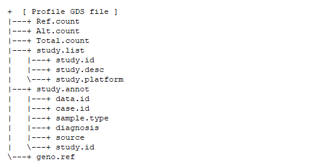

```{r style, echo=FALSE, results='hide', warning=FALSE, message=FALSE}
BiocStyle::markdown()

suppressPackageStartupMessages({
    library(knitr)
    library(RAIDS)
})

set.seed(121444)
```

<br />
**Package**: `r Rpackage("RAIDS")`<br />
**Authors**: `r packageDescription("RAIDS")[["Author"]]`<br />
**Version**: `r packageDescription("RAIDS")$Version`<br />
**Compiled date**: `r Sys.Date()`<br />
**License**: `r packageDescription("RAIDS")[["License"]]`<br />

# Introduction 


This is an overview of genetic ancestry inference from cancer-derived 
molecular data:

```{r graphMainSteps, echo=FALSE, fig.align="center", fig.cap="An overview of the genetic ancestry inference process.", out.width='120%', results='asis', warning=FALSE, message=FALSE}
knitr::include_graphics("MainSteps_v02.png")
```

The main steps are:

1. Format reference data from the 1000 Genomes (1KG) (optional)
2. Format cancer-derived data set starting from BAM files
3. Optimize ancestry inference parameters
4. Infer ancestry for the subjects of the external study

All steps from Step 2, sub-step 4, to Step 4 can be run through a 
wrapper (as described in [Main vignette](RAIDS.html). Those steps can also be 
run separately; this has the advantage of allowing finer parameter 
selection.

This vignette describes, in details, the process done by the wrapper from 
Step 2, sub-step 4, to Step 4.

<br>
<br>

## Step 1 - Format reference data from the 1000 Genomes (optional)


```{r graphStep1, echo=FALSE, fig.align="center", fig.cap="Step 1 - Formatting the information from the population reference dataset (optional)", out.width='120%', results='asis', warning=FALSE, message=FALSE}

```


The detail execution of this step is presented in 
the [Formatting the information from 1000 Genomes (optional)](Create_1KG_GDS_file.html) 
vignette.

In addition, the available pre-processed files are described in 
the [Main vignette](RAIDS.html).


<br>

## Step 2 - Prepare cancer-derived data for ancestry inference

Molecular profiles in a cancer-derived data set must be formatted 
following a series of sub-steps.

```{r graphStep2, echo=FALSE, fig.align="center", fig.cap="Step 2 - Formatting the information from an external study", out.width='120%', results='asis', warning=FALSE, message=FALSE}

```

<br>

These are:

1. Create a directory containing the 3 reference files from 1KG
2. Make a SNP pileup file for the profile
3. Create an RDS file containing information about the samples
4. Create a Profile GDS file (one GDS file per profile)
5. Generate a pruned subset of the single nucleotide variants (SNVs) 
6. Estimate the allelic frequency for the pruned SNVs

The first steps, from Sub-step 1 to Sub-step 3, are described in the 
[Main vigette](RAIDS.html).

### Sub-Step 2.4 Create a Profile GDS file (one GDS file per profile) 

This step requires 3 files as input:

- The **1KG GDS file**
- The **Profile SNP pileup file** (one per profile present in the study)
- The **Profile PED RDS file** (one file with information for all profiles in the study)

A *data.frame* containing the general information about the study is 
also required. The *data.frame* must contain those 3 columns:

- **study.id**: The study identifier (example: TCGA-BRCA).
- **study.desc**: The description of the study.
- **study.platform**: The type of sequencing (example: RNA-seq).

Using all those inputs, the *createStudy2GDS1KG()* function will 
generate a **Profile GDS file**. One **Profile GDS file** is created for each 
profile passed to the *listProfiles* argument.

```{r appendStudy2GDS1KG, echo=TRUE, eval=TRUE, collapse=TRUE, warning=FALSE, message=FALSE}
#################################################################
## Load required package
#################################################################
library(RAIDS)
    
#################################################################
## The 1KG GDS file location
## Note that the 1KG GDS file used for this example is a  
## simplified version and CANNOT be used for any real analysis
#################################################################
dataDir <- system.file("extdata", package="RAIDS")
path1KG <- file.path(dataDir, "example", "gdsRef")
    
gds1KG <- file.path(path1KG, "ex1kg.gds")

#################################################################
## The Profile SNP pileup files (one per profile) need  
## to be located in the same directory.
#################################################################
pathGeno <- file.path(dataDir, "example", "snpPileup")

#################################################################
## The path where the Profile GDS files (one per profile)
## will be created need to be specified.
#################################################################
pathProfileGDS <- file.path(dataDir, "example", "out")

#################################################################
## The path and file name for the PED RDS file
## will the information about the analyzed samples
#################################################################
filePED <- file.path(dataDir, "example", "pedEx.rds")
ped <- readRDS(filePED)
head(ped)

#################################################################
## A data frame containing general information about the study
## is also required. The data frame must have
## those 3 columns: "study.id", "study.desc", "study.platform"
#################################################################
studyDF <- data.frame(study.id="MYDATA",
                        study.desc="Description",
                        study.platform="PLATFORM",
                        stringsAsFactors=FALSE)

#################################################################
## The list of profiles to analyzed is passed to the function.
## The profiles must be present in the Profile PED RDS file see
## sub-step 4 and must have an associated Profile SNP pileup file.
## Not all profiles present in the Profile PED file need to 
## be selected.
#################################################################
listSamples <- ped[, "Name.ID"]

#################################################################
## This function creates one Profile GDS file for each
## profile present in the 'listProfiles' parameter.
#################################################################
createStudy2GDS1KG(pathGeno=pathGeno,
                        pedStudy=ped,
                        fileNameGDS=gds1KG,
                        listProfiles=listSamples,
                        studyDF=studyDF,
                        pathProfileGDS=pathProfileGDS,
                        genoSource="snp-pileup")

#################################################################
## The Profile GDS file has been created in the 
## directory pathProfileGDS using the name of the sample (ex1)
#################################################################
list.files(path=pathProfileGDS)
```

<br>

A **Profile GDS file** is created for each profile. The GDS file contains those 
nodes:

```{r graphStep24, echo=FALSE, fig.align="left", fig.cap="Step 2.4 - The nodes present in the newly created Profile GDS file (one GDS file per profile).", out.width='100%', results='asis', warning=FALSE, message=FALSE}

```

<br>


### Sub-Step 2.5 Generate a pruned subset of the single nucleotide variants (SNVs) 

The initial list of 1KG SNVs is pruned, using linkage disequilibrium analysis, 
and a profile-specific subset of SNVs is retained for each profile. This 
information is added to the **Profile GDS file**.

The __pruningSample()__ function requires the **1KG GDS file** as input. It 
also requires the path to the **Profile GDS file(s)**.

Note that this step can require large disk space.

```{r pruningProfile, echo=TRUE, eval=TRUE, warning=FALSE, message=FALSE}
#############################################################################
## Load required package
#############################################################################
library(RAIDS)
    
#############################################################################
## The 1KG GDS file is required (demo version)
## Note that the 1KG GDS file used for this example is a  
## simplified version and CANNOT be used for any real analyses
#############################################################################
path1KG <- file.path(dataDir, "example", "gdsRef")
    
fileGDS <- file.path(path1KG, "ex1kg.gds")

## Open the 1KG GDS file (demo version)
gds1KG <- snpgdsOpen(fileGDS)

#############################################################################
## The pruning function is called with one profile as input at the time
#############################################################################
for(i in seq_len(length(listSamples))) {
    ## Compute the SNV pruned subset
    ## studyID: Study identifier as defined in the preceding sub-step. 
    ##           The study identifier must be the same that the one present in
    ##           Profile GDS file.
    ## pathProfileGDS: All Profile GDS files must be in the same directory. 
    pruningSample(gdsReference=gds1KG,
                    currentProfile=listSamples[i],
                    studyID=studyDF$study.id,
                    pathProfileGDS=pathProfileGDS)
    
    ## Profile GDS file for the current profile
    ## The file name corresponds to the path + profile identifier + ".gds"
    fileGDSProfile <- file.path(pathProfileGDS, paste0(listSamples[i], ".gds"))
    
    ## Add the genotype information for the list of pruned SNVs 
    ## into the Profile GDS file
    ## The genotype information is extracted from the 1KG GDS file
    add1KG2SampleGDS(gdsReference=gds1KG, fileProfileGDS=fileGDSProfile,
                        currentProfile=listSamples[i],
                        studyID=studyDF$study.id)

    ## Add annotation from the 1KG GDS file to the Profile GDS file
    ## This is required.
    addStudy1Kg(gdsReference=gds1KG, fileProfileGDS=fileGDSProfile, 
                        verbose=FALSE)
}
    
## Close the 1KG GDS file (it is important to always close the GDS files)
closefn.gds(gds1KG)
```

<br>

The nodes, with the genotype information for the pruned SNVs, are added into  
the **Profile GDS file**: 

```{r graphStep25, echo=FALSE, fig.align="left", fig.cap="Step 2.5 - The nodes added to the Profile GDS file are in light blue.", out.width='100%', results='asis', warning=FALSE, message=FALSE}

```

<br>

### Sub-Step 2.6 Estimate the allelic fraction for the pruned SNVs

The __estimateAllelicFraction()__ estimates the allele fraction for all 
SNVs present in the pruned SNV list. Note that the function requires 
different inputs for DNA and RNA profiles.

For the DNA profiles, these 2 files are required:

1. The **Profile GDS file**
2. The **1KG GDS file**

For the RNA profiles, these 3 files are required:

1. The **Profile GDS file**
2. The **1KG GDS file**
3. The **1KG SNV Annotation GDS file**

In both cases, the other required inputs are:

1. The information about the length of the chromosomes
2. The profile identifier (it corresponds to the Profile GDS file name)
3. The study identifier (it should correspond to the one used previously)

The information about the length of the chromosomes must be assigned into a 
*vector* object. This is an example on how to retrieve the information. 
There are alternative ways to retrieve this information, e.g., 

```{r extractChrLength, echo=TRUE, message=FALSE, warning=FALSE, collapse=TRUE}
###################################################################
## Load required library
###################################################################
library(BSgenome.Hsapiens.UCSC.hg38)
library(GenomeInfoDb)
###################################################################
## The length of each chromosome is required
## Chromosomes X, Y and M need relabeling (see below)
## There are alternative ways to retrieve this information
###################################################################
chrInfo <- GenomeInfoDb::seqlengths(Hsapiens)[1:25]
```

<br>
<br>

The __estimateAllelicFraction()__ function processes one profile at the time, 
as shown in this example.  


```{r estimateAllelicFraction, echo=TRUE, eval=TRUE, collapse=TRUE, warning=FALSE, message=FALSE}
#####################################################################
## Load the required packages
#####################################################################
library(RAIDS)
library(gdsfmt)

#####################################################################
## The 1KG GDS file is required
## The 1KG SNV Annotation GDS file is only required for RNA profiles
#####################################################################
path1KG <- file.path(dataDir, "example", "gdsRef")
    
file1KG <- file.path(path1KG, "ex1kg.gds")
fileAnnot1KG <- file.path(path1KG, "exAnnot1kg.gds")

## Open the 1KG GDS file
gds <- snpgdsOpen(file1KG)
    
#####################################################################
## The information about the length of the chromosomes
#####################################################################
head(chrInfo)

#####################################################################
## The function must be called for each profile
## This example only uses one profile
#####################################################################
## The first profile is used in the demo
profileName <- listSamples[1]

#####################################################################
## The Profile GDS file is required
#####################################################################
## The name must correspond to the profile identifier
fileProfile <- file.path(pathProfileGDS, paste0(profileName, ".gds"))

## Open the Profile GDS file in writing mode
gdsProfile <- openfn.gds(fileProfile, readonly=FALSE)

###################################################################
## The estimation of the allelic fraction
###################################################################
## Estimate the allele fraction of the pruned SNVs
## The current example is for a DNA sample
## In the case of RNA sample, the function needs different inputs
## such as the 1KG Annotation GDS file and
## the 'blockID' should be as listed in the 1KG Annotation GDS file 
## for the gene annotation of the SNVs
estimateAllelicFraction(gdsReference=gds, gdsProfile=gdsProfile,
                                        currentProfile=profileName,
                                        studyID=studyDF$study.id,
                                        chrInfo=chrInfo)

## Close both GDS files (important)
closefn.gds(gdsProfile)
closefn.gds(gds)
```

<br>

This step must be executed for each profile present in the study.

The information is added into the 'lap' and 'segment' nodes:

```{r graphStep26, echo=FALSE, fig.align="left", fig.cap="Step 2.6 - The information is added into the nodes in light blue.", out.width='100%', results='asis', warning=FALSE, message=FALSE}

```


<br>


## Step 3 - Optimize the ancestry inference parameters

At this step, optimization of the parameters is required to maximize the 
the ancestry inference accuracy (next step).

```{r graphStep3, echo=FALSE, fig.align="center", fig.cap="Step 3 - Find the optimized parameters for the ancestry inference", out.width='120%', results='asis', warning=FALSE, message=FALSE}
knitr::include_graphics("MainSteps_Step3_v02.png")
```

Two inference parameters to be optimized:

- _K_: the number of neighbors used to call the ancestry
- _D_: the number of PCA components retained

The accuracy is evaluated using a synthetic data set created from merging one 
cancer profile with multiple population referecne profiles of known ancestry. Using the 
synthetic profiles, a range of _K_ and _D_ values are tested. Through that 
process, the _K_ and _D_ values are tuned to maximize accuracy.

This step consists of two sub-steps:

1. Generate the synthetic dataset
2. Compute the PCA-KNN ancestry call for each synthetic profile

<br>

### Sub-Step 3.1 Generate the synthetic dataset

A synthetic profile is generated through the merging of one cancer profile 
with one 1KG profile of known ancestry. Multiple 1KG profiles of different 
ancestry are required to create a synthetic data set that will be able to 
show the specific accuracy for each super-population. All the synthetic 
profiles are saved in the **Profile GDS file** corresponding to the 
cancer profile used to generate the synthetic dataset.

In summary, a fixed number of profiles for each super-population are extracted 
from the 1KG study. The information is saved into the **Profile GDS file** 
associated to the selected cancer profile. A synthetic profile is created for 
each combination of one 1KG profile and cancer profile. All synthetic profiles 
are then saved into the **Profile GDS file**.

The three functions _select1KGPop()_, _prepSynthetic()_ and _syntheticGeno()_ 
are required to process the synthetic data synthesis step.

These 3 files are required:

1. The **Profile GDS file**
2. The **1KG GDS file**
3. The **1KG Annotation GDS file**


```{r generateSynthetic, echo=TRUE, eval=TRUE, collapse=TRUE, warning=FALSE, message=FALSE}
####################################################################
## Load required packages
####################################################################
library(RAIDS)    
library(gdsfmt)

####################################################################
## Randomly extract a fixed number of profiles for each
## subcontinental population present in the 1KG GDS file.
## When not enough profiles are available, all profiles are selected.  
####################################################################   
gds1KG <- snpgdsOpen(file1KG)

####################################################################
## Fix seed to ensure reproducible results
####################################################################
set.seed(3043)   

####################################################################
## Select the profiles from 1KG for the synthetic data.
## Here we select 2 profiles from 1KG for each subcontinental-level
## Normally, we use 30 profiles from 1KG for each 
## subcontinental-level but it is too big for the example.
## The 1KG GDS file in this example only has 6 profiles for each 
## subcontinental-level (for demo purpose only)
####################################################################
dataRef <- select1KGPop(gds1KG, nbProfiles=2L)

## Extract the list of selected 1KG sample identifiers
listProfileRef <- dataRef$sample.id

####################################################################
## A data.frame with the description of the study for the synthetic
## data is required.
## The column names must be as shown
#################################################################### 
syntheticStudyDF <- data.frame(study.id="MYDATA.Synthetic",
                          study.desc="MYDATA synthetic data",
                          study.platform="PLATFORM",
                          stringsAsFactors=FALSE)

## The Profile GDS file is needed
fileProfile <- file.path(pathProfileGDS, paste0(profileName, ".gds"))

####################################################################
## The prepSynthetic() function prepares the annotation for
## the synthetic data
## The information is saved into the Profile GDS file
####################################################################
prepSynthetic(fileProfileGDS=fileProfile,
                listSampleRef=listProfileRef,
                profileID=profileName,
                studyDF=syntheticStudyDF,
                prefix="1")

####################################################################
## Both the 1KG GDS file and the 1KG Annotation GDS file
## are required
####################################################################
path1KG <- file.path(dataDir, "example", "gdsRef")
fileRefAnnot <- file.path(path1KG, "exAnnot1kg.gds")

## Open  1KG Annotation GDS file    
gdsRefAnnot <- openfn.gds(fileRefAnnot)

####################################################################
## The syntheticGeno() function generates the synthetic profiles.
## The synthetic profiles are saved in the Profile GDS file
####################################################################
resG <- syntheticGeno(gdsReference=gds1KG,
                        gdsRefAnnot=gdsRefAnnot,
                        fileProfileGDS=fileProfile,
                        profileID=profileName,
                        listSampleRef=listProfileRef,
                        prefix="1")

## Close both GDS files
closefn.gds(gds1KG)
closefn.gds(gdsRefAnnot)
```

<br>


### Sub-Step 3.2 Perform the PCA-KNN ancestry call for each synthetic profile

The ancestry is inferred for each synthetic profile. As the ancestry of origin 
of the 1KG profile used to generate the synthetic profile is known, the 
accuracy of the calls will be assessed for different parameters.

```{r PCA.KNN.Synthetic, collapse=TRUE, echo=TRUE, eval=TRUE, warning=FALSE, message=FALSE}
#####################################################################
## Load required packages
#####################################################################
library(RAIDS)    
library(gdsfmt)   
    
####################################################################
## The 1KG GDS file is required
#####################################################################
## Open the 1KG GDS file     
gds <- openfn.gds(file1KG)

#####################################################################
## The path to the directory where the PCA results will be saved 
## in RDS files.
## The directory must exist.
#####################################################################
pathOut <- file.path(pathProfileGDS)

if(! file.exists(pathOut)) {
    dir.create(pathOut)
}

#####################################################################
## Get the super-population information (known ancestry) for the 
## reference profiles. This is the ground truth for the 1KG profiles.
#####################################################################
refKnownSuperPop <- getRef1KGPop(gds, "superPop")
    
#####################################################################
## Fix the RNG seed as in step 6 to ensure the same results
#####################################################################    
set.seed(3043)       
    
## Select the 1KG samples used to generate the synthetic dataset
## Already done in step 6, no need to repeat if the results have been saved
dataRef <- select1KGPop(gds, nbProfiles=2L)

#####################################################################
## The function splitSelectByPop() generates a matrix with the
## reference samples split by sub-continental population
#####################################################################  
sampleRM <- splitSelectByPop(dataRef)
    
## Loop for all cancer samples with associated synthetic data
for(i in seq_len(length(listSamples))) {

    ## The Profile GDS file associated to the cancer profile     
    fileProfile <- file.path(pathProfileGDS,
                                    paste0(listSamples[i], ".gds"))

    ## A sub-directory is created for the cancer sample
    ## Beware that the number of files created will correspond to the 
    ## number of rows in the sampleRM matrix
    pathOutProfile <- file.path(pathOut, listSamples[i])
    if(! file.exists(pathOutProfile)) {
            dir.create(pathOutProfile)
    }
    
    ## Open the Profile GDS file      
    gdsProfile <- snpgdsOpen(fileProfile)

    ## For each row of the sampleRM matrix      
    for(j in seq_len(nrow(sampleRM))) {
        ## Run a PCA analysis using 1 synthetic profile from each 
        ##  sub-continental ancestry
        ## The synthetic profiles are projected on the 1KG PCA space 
        ##  (the 1KG reference profiles used to generate the synthetic profiles 
        ##  are removed from this PCA)
        ## The K-nearest neighbors analysis is done using 
        ##  a range of K and D values
        syntKNN <- computePoolSyntheticAncestryGr(gdsProfile=gdsProfile,
                                        sampleRM=sampleRM[j,],
                                        studyIDSyn=syntheticStudyDF$study.id,
                                        np=4L,
                                        spRef=refKnownSuperPop,
                                        eigenCount=15L)
        
        ## Results are saved
        saveRDS(syntKNN$matKNN, file.path(pathOutProfile, 
                        paste0("KNN.synt.", listSamples[i], ".", j, ".rds")))
    }
    
    ## Close Sample GDS file (important)
    closefn.gds(gdsProfile)
}
    
## Close 1KG GDS file (important)
closefn.gds(gds)
```


<br>

## Step 4 - Run the ancestry inference in the input data set

The ancestry inference is done with the optimized _K_ and _D_ parameters. More 
specifically, a PCA is generated using the 1KG reference samples and the 
cancer sample. The _D_ parameter specifies the number of dimension for the 
PCA. Then, the ancestry of the cancer sample is inferred using
a k-nearest neighbors classification method. The _K_ parameter specifies the 
number of neighbors used for the classification.


```{r graphStep4, echo=FALSE, fig.align="center", fig.cap="Step 4 - Run the ancestry inference on the external study", out.width='120%', results='asis', warning=FALSE, message=FALSE}
knitr::include_graphics("MainSteps_Step4_v01.png")
```

<br>

The PCA of the sample and KNN sample and Call the ancestry with the optimal 
_K_ and _D_ parameters.

Note: The formal selection of _K_ and _D_ parameters is done at this step but 
all the synthetic data are prepared in the previous step. 


```{r PCA.KNN.Sample, warning=FALSE, message=FALSE, collapse=TRUE, echo=TRUE, eval=TRUE}
####################################################################
## Load required packages
####################################################################
library(RAIDS)    
library(gdsfmt)   

####################################################################
## The reference 1KG GDS file is required
####################################################################

## Open the 1KG GDS file 
gdsReference <- openfn.gds(file1KG)
    
## A directory where result files are going to be saved, 
## where a sub-directory will be set up for each input profile 
pathOut <- file.path(pathProfileGDS)

if(! file.exists(pathOut)) {
    dir.create(pathOut)
}

####################################################################
## The getRef1KGPop() function extract the known super-population 
## of the reference samples.
## We expect the ancestry call from a synthetic profile to 
## correspond to the known ancestry of the reference sample used to 
## synthesize it.
####################################################################
refKnownSuperPop <- getRef1KGPop(gdsReference, "superPop")
    
## Loop on each profile 
## Can also be run in parallel or on different clusters...
for(i in seq_len(length(listSamples))){
    
    ## Extract the GDS file name and path for the current profile      
    fileProfile <- file.path(pathProfileGDS, paste0(listSamples[i], ".gds"))
    
    ## Directory where the KNN results of the synthetic profiles have been saved      
    pathKNN <- file.path(pathOut, listSamples[i])
    listFilesName <- dir(file.path(pathKNN), ".rds")

    ## List of the KNN result files from PCA run on synthetic data
    listFiles <- file.path(file.path(pathKNN) , listFilesName)

    ## Open the Profile GDS file
    gdsProfile <- snpgdsOpen(fileProfile)

    ## Select the optimal K and D parameters from the synthetic data results
    ## Use those parameter to infer the ancestry of the specific profile
    resCall <- computeAncestryFromSyntheticFile(gdsReference=gdsReference, 
                                    gdsProfile=gdsProfile,
                                    listFiles=listFiles,
                                    currentProfile=listSamples[i],
                                    spRef=refKnownSuperPop,
                                    studyIDSyn=syntheticStudyDF$study.id,
                                    np=1L)

    saveRDS(resCall, file.path(pathOut,
                                paste0(listSamples[i], ".infoCall", ".rds")))

    write.csv(resCall$Ancestry,
            file.path(pathOut, paste0(listSamples[i], ".Ancestry",".csv")),
            quote=FALSE, row.names=FALSE)
    
    ## Close the Profile GDS file (important)
    closefn.gds(gdsProfile)
}

## Close the 1KG GDS file (important)
closefn.gds(gdsReference)

####################################################################
## Show the ancestry inference (SuperPop) and 
## optimal number of PCA components D
## optimal number of neighbours K
####################################################################
resAncestry <- read.csv(file.path(pathOut, 
                    paste0(ped$Name.ID[1], ".Ancestry.csv")))
resAncestry

## Clean-up demo files
unlink(fileProfile, force=TRUE)
unlink(pathOut, recursive=TRUE, force=TRUE)
```


The *computeAncestryFromSyntheticFile()* function generates 3 types of files 
in the *OUTPUT* directory.

* The ancestry inference CSV file (".Ancestry.csv" file) 
* The inference information RDS file (".infoCall.rds" file)
* The parameter information RDS files from the synthetic inference ("KNN.synt.*.rds" files in a sub-directory)

In addition, a sub-directory (named using the *profile ID*) is 
also created. 


# Session info

Here is the output of `sessionInfo()` in the environment in which this 
document was compiled:

```{r sessionInfo, echo=FALSE}
sessionInfo()
```

<br>
<br>


