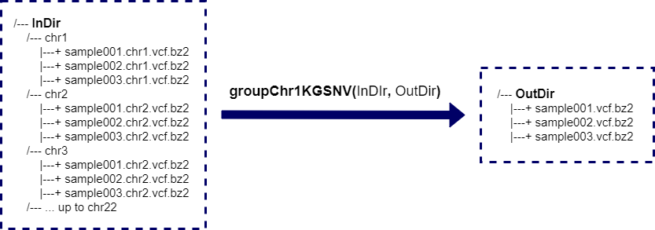

```{r style, echo=FALSE, results='hide', warning=FALSE, message=FALSE}
BiocStyle::markdown()

suppressPackageStartupMessages({
    library(knitr)
    library(RAIDS)
})

set.seed(121444)
```

<br />
**Package**: `r Rpackage("RAIDS")`<br />
**Authors**: `r packageDescription("RAIDS")[["Author"]]`<br />
**Version**: `r packageDescription("RAIDS")$Version`<br />
**Compiled date**: `r Sys.Date()`<br />
**License**: `r packageDescription("RAIDS")[["License"]]`<br />


<br>
<br>

# Step 1 - Formatting the information from 1000 Genomes (optional)


This is an overview of the main steps to infer the genetic ancestry  
from cancer-derived molecular data:

1. Format the information from 1000 Genomes (1KG) into a 1KG GDS file (optional)
2. Format the information from an external study
3. Find the optimized parameters for the ancestry inference
4. Run the ancestry inference on the external study


```{r graphStep1, echo=FALSE, fig.align="center", fig.cap="Step 1 - Formatting the information from 1000 Genomes (optional)", out.width = '120%', results='asis'}
knitr::include_graphics("MainSteps_Step1_v01.png")
```


******

<span style="color:darkred;font-weight:bold">Beware that a pre-processed 1KG 
GDS file is available at this address:</span>

<span style="color:red">
[https://labshare.cshl.edu/shares/krasnitzlab/aicsPaper/matGeno1000g.gds](https://labshare.cshl.edu/shares/krasnitzlab/aicsPaper/matGeno1000g.gds)
</span>

<span style="color:darkred;font-weight:bold">The size of the file is 15GB.</span>
<span style="color:darkred;font-weight:bold">This section can be skipped if you choose to use this file.</span>

******


This section explains in further details how to generate the 1000 Genomes (1KG) 
GDS file that is needed to run the ancestry inference tool (step 1). Beware 
that it is unnecessary to re-run those steps as the 1KG GDS file is 
publicly available. 

More specifically, the formatting of the 1KG information includes all those 
sub-steps:

1. Download the required files from 1KG
2. Split the 1KG genotyping file to one file per sample per chromosome
3. Combine the chromosomes to obtain one genotyping file per sample
4. Create a pedigree file in RDS format
5. Prepare a bulk SNP information file based on 1KG VCF
6. Filter the bulk SNP information file
7. Generate the GDS file with the 1KG information
8. Identify genetically related patients present in 1KG GDS file
9. Add information about unrelated patients to the 1KG GDS file
10. Create a second GDS file containing the 1KG phase information

Beware that those sub-steps are time, as well as, space consuming.

In the following sections, those sub-steps are described in details.

<br>

## Download the required files from 1KG

First, the pedigree file with the description of the 1KG samples
needs to be downloaded from the 1KG ftp site:

> ftp://ftp.1000genomes.ebi.ac.uk/vol1/ftp/technical/working/20130606_sample_info/20130606_g1k.ped

The genotyping files for the 1KG samples also needs to be downloaded. Beware 
that there is one file per chromosome:

> ftp.1000genomes.ebi.ac.uk/vol1/ftp/data_collections/1000_genomes_project/release/20181203_biallelic_SNV

As the genotyping files are split by chromosome, all files corresponding to 
this pattern must be downloaded:

> ALL.chr\*.shapeit2_integrated_v1a.GRCh38.20181129.phased.vcf.gz

All files are related to GRCh38 genome.

<br>
<br>

## Split the 1KG genotyping file to one file per sample per chromosome

To facilitate the manipulation of the genotyping data, the large 1KG
genotyping files are split into smaller files (one per sample).

As there is one genotyping file per chromosome, the process must be executed 
for each of chromosome

The splitting is done through a bash script:

```bash
## This in not a R script
## This script is in bash

## The script has to be run separately for each chromosome

## Create one directory for the specific chromosome
##
## Two variables need to be assigned
## The variable PATHGENO is the path where the split 1KG genotyping
##   files will be located
## The variable chrCur is the current chromosome (ex: "chr1"), a sub-directory 
##   with the name of the chromosome will be created. The variable must
##   include the prefix "chr".
##
## Ex: PATHGENO=./genotypingPerSample
## Ex: chrCur=chr1
##
mkdir ${PATHGENO}/${chrCur}
cd ${PATHGENO}/${chrCur}

## The variable FILECUR is the associated 1KG genotyping VCF file for the
##     specific chromosome
## The variable FILECUR must also contain the relative or complete path to
##     the VCF file
## Ex: FILECUR=../../1KG_files/ALL.chr1.shapeit2_integrated_v1a.GRCh38.20181129.phased.vcf.gz

## There is 2548 samples in one phase VCF file
## The information associated to each sample is extracted and a VCF file 
## specific to each sample for the current chromosome is generated
##
for i in `seq 1 2548`
do
    j=$(( $i + 9 ))
    SAMPLE=$(zcat $FILECUR||head -n 1000 |grep "#CHROM"|cut -d$'\t' -f$j)
    zcat $FILECUR|grep -v "##"|cut -d$'\t' -f$j |bzip2 -c > ${SAMPLE}.${CHR}.vcf.bz2
done
```

<br>
<br>

## Combine the chromosomes to obtain one genotyping file per sample

The genotyping information for all chromosomes is merged so that there is only 
one genotyping file per sample.


```{r graphChr1KGSNV, echo = FALSE, fig.align="center", fig.cap="The function groupChr1KGSNV() merge samples that are split by chromosomes into one file.", out.width = '120%', results='asis'}

```


The __groupChr1KGSNV()__ function is used to combine the genotyping information 
from multiple files.

```{r fileGenopart2, echo=TRUE, eval=FALSE}
## Load required package
library(RAIDS)

## The path where the genotyping files are located
pathGenoChr <- file.path("data", "pathgenochr")

## The path where the merged genotyping files will be created
PATHOUT <- file.path("data", "pathgenoOUT")

## Combining the genotyping information for all chromosome in one file per
## profile
groupChr1KGSNV(pathGenoChr=pathGenoChr, pathOut=PATHOUT)

```

<br>
<br>

## Create a predigree file in RDS format

The function __prepPed1KG()__ is used to create the pedigree file 
in RDS format:

```{r prepPed1KG, eval=FALSE, echo=TRUE}
## Load required package
library(RAIDS)

## The path to the pedigree file from 1KG
## In this example, the file is in the current directory
filePED1KGOri <- "20130606_g1k.ped"

## Extract needed information from the pedigree file from 1KG into a data.frame
## Only the samples with genotyping information (sample file present
## in pathGeno parameter) are retained to create the final data.frame
ped <- prepPed1KG(filePed=filePED1KGOri,
                    pathGeno=file.path("data", "sampleGeno"))

## Save the pedigree information data.frame as a RDS file
## In this example, the file is saved here ./data/metadata/ped1KG.rds
filePED1KG <- file.path("data", "metadata","ped1KG.rds")
saveRDS(ped,  filePED1KG)

```


<br>
<br>

## Prepare a bulk SNP information file based on 1KG VCF

Some intermediate file containing the SNP information from 1KG need to be
generated so the information can ultimately be imported in a GDS file 
using Bioconductor [gdsfmt](https://bioconductor.org/packages/gdsfmt/).

The bulk intermediate SNP file contains the SNP position as well as the 
frequency in each super population.

```{r intermediateVCF, echo=TRUE, eval=FALSE}
## This is not done in R
## The python script is in the 'scriptsPy' directory

for i in `ls PATHVCF/*shapeit2_integrated_v1a.GRCh38.20181129.phased.vcf.gz`
do
    chr=$(echo $FILECUR|perl -n -e '/ALL\.(chr[^\.]+)/;print $1')
    python PATH2SCRIPT/extract1000gFreq.py ${FILECUR} matFreq.${chr}
done

for i in `seq 1 22`
do
    cat matFreq.chr${i}.txt >matFreqSNV.txt
    bzip2 matFreqSNV.txt
done

```

The bulk SNP info file is called __matFreqSNV.txt.bz2__.

<br>
<br>

## Filter the bulk SNP information file

The bulk SNP file is filtered to only retain the SNPs with frequency 
higher then a specific cut-off (here >=0.01) for at least one super 
population. 

The filter SNP file is saved in RDS format (_fileSNPsRDS_ parameter). A
second file containing the index of the retained SNPs is also 
created (*fileSNPsRDS* parameter)

The function __generateMapSnvSel()__ is used to filter the SNP file and 
generated the needed RDS files:

```{r filterVCF, echo=TRUE, eval=FALSE}
## Load required package
library(RAIDS)

## The path to the bulk SNP info file
fileSNV.v <- file.path(pathGeno, "matFreqSNV.txt.bz2")

## The paths and names of the two output files
## One file contains the index of retained SNPs ("listSNP.rds")
## One file contains the filter SNP information ("mapSNVSel.rds")
fileSNPsRDS <- file.path(PATHSEL, "listSNP.rds")
fileFREQ.v <- file.path(PATHSEL, "mapSNVSel.rds")

## Filter the bulk SNP file (fileSNV parameter)
## Create a RDS with filter SNPs (fileFREQ parameter)
## Also creates a RDS with the indexes of the retained SNPs (fileFREQ parameter)
generateMapSnvSel(cutOff=0.01, fileSNV=fileSNV.v,
                         fileSNPsRDS=fileSNPsRDS,
                         fileFREQ=fileFREQ.v)
```


<br>
<br>


## Generate the GDS file with the 1KG information

The CoreArray Genomic Data Structure (GDS) data files are files suited for 
large-scale datasets, especially for data which are much larger than the 
available random-access memory.

The function __generateGDS1KG()__ is used to generate the GDS file that will
contain the information related to 1KG:

```{r gdsCreation, echo=TRUE, eval=FALSE}
## TODO: what is PATHMETA and PATHSEL

## The path and file names of the required files
## First, the RDS file containing the pedigree information
## Second, the RDS file with the indexes of the retained SNPs
## Third, the RDS file with the filtered SNP information
filePED1KG <- file.path(PATHMETA,"ped1KG.rds")
fileSNPsRDS <- file.path(PATHSEL, "listSNP.rds")
fileFREQ.v <- file.path(PATHSEL, "mapSNVSel.rds")

## The name of the GDS file that will be created
fileNameGDS <- "matGeno1000g.gds"
fileGDS <- file.path(PATHGDS, fileNameGDS)

## Generate GDS file containing the 1KG information
generateGDS1KG(pathGeno=file.path("data", "sampleGeno"),
                    filePedRDS=filePED1KG,
                    fileSNPSel=fileFREQ.v,
                    fileSNVIndex=fileSNPsRDS,
                    fileNameGDS=fileGDS)
```


<br>
<br>

## Identify genetically related patients present in 1KG GDS file

As only unrelated patients can be used in the following analyses, the 
genetically related patients in 1KG must be identified.

The function __identifyRelative()__ identifies patients that are genetically 
related in the 1KG files. It generates a RDS file with the unrelated patient 
information (_filePart_ parameter) as well as a RDS file with the kinship 
coefficient between the patients (_fileIBD_ parameter).

```{r identifyRelative, echo=TRUE, eval=FALSE}
## Load required package
library(gdsfmt)

## TODO: what is PATHMETA

## The name of the GDS file that contains the 1KG information
fileNameGDS <- "matGeno1000g.gds"
fileGDS <- file.path(PATHGDS, fileNameGDS)

## Files that will be created by the identifyRelative() function
## The first RDS file will contain the kinship information between patients
## The second RDS file will contain the list of unrelated patients
fileIBD <- file.path(PATHMETA,"ibd.All.0.05.rds")
filePart <- file.path(PATHMETA,"part.All.0.05.rds")

## Open the 1KG GDS file
gds <- snpgdsOpen(fileGDS)

## Identify the genetically related patients in 1KG
identifyRelative(gds=fileGDS, maf=0.05, thresh = 2^(-11/2),
                        fileIBD=fileIBD, filePart=filePart)

## Close the 1KG GDS file
closefn.gds(gds)
```

<br>
<br>


## Add information about unrelated patients to the 1KG GDS file

Only the unrelated patients from 1KG are used in the following ancestry 
inference and kept in the GDS 1KG file. The function __identifyRelative()__ 
identifies the unrelated patients and saves the information about those 
patients in an intermediate external file. 

The function __addRef2GDS1KG()__ is adding the information about the unrelated
patients to the GDS 1KG file using the intermediate external file.

```{r addRef2GDS1KG, echo=TRUE, eval=FALSE}
## Add the information about the unrelated 1KG patients to the 1KG GDS file
addRef2GDS1KG(fileGDS=gds,  filePart=filePart)
```

<br>
<br>

## Create a second GDS containing the 1KG phase information 

We generate a GDS with the phase information.

The function __generatePhase1KG2GDS()__ is adding the phase information 
into the newly created 1KG GDS phase file.

```{r addPhaseGDS1KG, echo=TRUE, eval=FALSE}
## Load required package
library(gdsfmt)

## The name of the 1KG GDS file that already exists
fileGDS1KG <- file.path(PATHGDS, "matGeno1000g.gds")

## The name of the 1KG Phase GDS file that will be created
fileGDSPhase <- file.path(PATHGDS, "matPhase1000g.gds")

## Open the 1KG GDS file
gds <- openfn.gds(fileGDS1KG)

## Create the 1KG Phase GDS file
gdsPhase <- createfn.gds(fileGDSPhase)

## Add the phase information to the 1KG Phase GDSfile
generatePhase1KG2GDS(gds, gdsPhase, pathGeno, fileSNPsRDS)

## Close both files
closefn.gds(gdsPhase)
closefn.gds(gds)
```

<br>
<br>

### Create a VCF file containing the retained SNP positions from 1KG GDS file

The __snvListVCF()__ function is used to generate a VCF file that contains
the information of all retained SNPs from 1KG GDS file:

```{r snvListVCF, echo=TRUE, eval=FALSE}
## Load required package
library(RAIDS)

## Open the 1KG GDS file
gds <- snpgdsOpen(fileGDS1kg)

## The VCF file that will be created
fileOUT <- "SNPretained.VCF"

## Generate the VCF with the retained SNP position
snvListVCF(gdsReference=gds, fileOUT=fileOUT, offset=1, freqCutoff=NULL)

## Close the 1KG GDS file
closefn.gds(gds)
``` 

You should compress and indexing the newly created VCF file. Do do so, 
you need to install [HTSlib](http://www.htslib.org/download/) [@Bonfield2021].

In a terminal:

```bash
## This in not a R script
## This script is in bash

## Compress the new VCF file (fileOUT parameter)
bgzip fileOUT

## Index the new VCF file
## HTSlib software is needed
tabix -p vcf fileOUT.gz
```


<br>
<br>

# Pre-processed files are available

Pre-processed files, such as the 1KG GDS file, are available at this address:


[https://labshare.cshl.edu/shares/krasnitzlab/aicsPaper](https://labshare.cshl.edu/shares/krasnitzlab/aicsPaper)

Beware that some of those files are voluminous.

<br>
<br>

# Session info

Here is the output of `sessionInfo()` on the system on which this document was 
compiled:

```{r sessionInfo, echo=FALSE}
sessionInfo()
```

<br>
<br>

