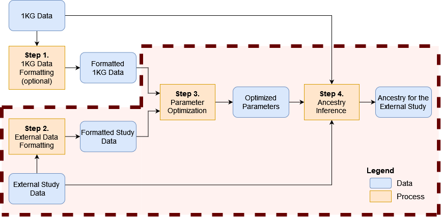

```{r style, echo=FALSE, results='hide', warning=FALSE, message=FALSE}
BiocStyle::markdown()

suppressPackageStartupMessages({
    library(knitr)
    library(RAIDS)
})

set.seed(121444)
```

<br />
**Package**: `r Rpackage("RAIDS")`<br />
**Authors**: `r packageDescription("RAIDS")[["Author"]]`<br />
**Version**: `r packageDescription("RAIDS")$Version`<br />
**Compiled date**: `r Sys.Date()`<br />
**License**: `r packageDescription("RAIDS")[["License"]]`<br />


# Licensing 

The `r Githubpkg("KrasnitzLab/RAIDS")` package and the underlying 
`r Githubpkg("KrasnitzLab/RAIDS")` code are distributed under  
the https://opensource.org/licenses/Apache-2.0 license. You are free to use and 
redistribute this software.  

<br>
<br>

# Citing

If you use the **RAIDS** package for a publication, we would ask you to cite 
the following:

> Pascal Belleau, Astrid Deschênes, Nyasha Chambwe, David A. Tuveson, Alexander Krasnitz; Genetic Ancestry Inference from Cancer-Derived Molecular Data across Genomic and Transcriptomic Platforms. Cancer Res 1 January 2023; 83 (1): 49–58. https://doi.org/10.1158/0008-5472.CAN-22-0682
<br>
<br>

# Introduction

Multiple methods have been implemented to infer ancestry from germline DNA 
sequence [@Price2006; @Pritchard2000; @Alexander2009]. However, genotyping of 
DNA from matched normal specimens is not part of standard clinical practice
and is not performed routinely outside academic clinical centers. 
In sum, matched germline DNA sequence is often missing for cancer-derived 
molecular data. In such cases, having the possibility to infer ancestry 
from tumor-derived data would be beneficial.

The **RAIDS** package implements an inference procedure that has been
specifically developed to accurately infer genetic ancestry from 
cancer-derived sequences. The current version can handle cancer-derived 
sequences of:

* tumor exomes
* targeted gene panels 
* RNA

The **RAIDS** package implements a data synthesis method that, for any given
cancer-derived sequence profile, enables 
on the one hand, profile-specific inference
parameter optimization and on the other hand, a profile-specific inference
accuracy estimate.

<br>
<br>

# Installation

To install the latest version from the 
[RAIDS Github Website](https://github.com/KrasnitzLab/RAIDS "RAIDS Github Site"), 
the `r CRANpkg("devtools")` package is required.

```{r installDemo01, eval=FALSE, warning=FALSE, message=FALSE}
## Load required package
library(devtools)

## Install the latest version of RAIDS
devtools::install_github('KrasnitzLab/RAIDS')
```

<br>
<br>

<a name="mains"></a>

# Main Steps


This is an overview of genetic ancestry inference from cancer-derived 
molecular data:

```{r graphMainSteps, echo=FALSE, fig.align="center", fig.cap="An overview of the genetic ancestry inference process.", out.width='120%', results='asis', warning=FALSE, message=FALSE}
knitr::include_graphics("MainSteps_v01.png")
```

The main steps are:

1. Format reference data from the 1000 Genomes (1KG) (optional)
2. Format cancer-derived data set starting from BAM files
3. Optimize ancestry inference parameters
4. Infer ancestry for the subjects of the external study

These main steps are described in detail in the following.

You can also run the steps from Step 2 Sub-step 4 to the end, with the 
default parameters,
in one command with the [wrapper](#wrapper) function.

<br>
<br>

## Step 1 - Format reference data from the 1000 Genomes (optional)


```{r graphStep1, echo=FALSE, fig.align="center", fig.cap="Step 1 - Formatting the information from 1000 Genomes (optional)", out.width='120%', results='asis', warning=FALSE, message=FALSE}
knitr::include_graphics("MainSteps_Step1_v01.png")
```


******

At this step three important reference files are created:

- The 1KG GDS File
- The 1KG SNV Annotation GDS file
- The 1KG SNV Retained VCF file

<span style="color:darkred;font-weight:bold">Note that these pre-processed 
files are available at:</span>

<span style="color:red">
[https://labshare.cshl.edu/shares/krasnitzlab/aicsPaper](https://labshare.cshl.edu/shares/krasnitzlab/aicsPaper)
</span>

<span style="color:darkred;font-weight:bold">The size of the 1KG GDS file 
is 15GB.</span>

<span style="color:darkred;font-weight:bold">The 1KG GDS file is mapped on 
hg38 [@Lowy-Gallego2019a].</span>

<span style="color:darkred;font-weight:bold">This section can be skipped if 
you choose to use the pre-processed files.</span>

The execution of this step is explained in the [Formatting the information from 1000 Genomes (optional)](Create_1KG_GDS_file.html) 
vignette.

<br>

## Step 2 - Prepare cancer-derived data for ancestry inference

Molecular profiles in a cancer-derived data set must be formatted 
following a series of sub-steps.

```{r graphStep2, echo=FALSE, fig.align="center", fig.cap="Step 2 - Formatting the information from an external study", out.width='120%', results='asis', warning=FALSE, message=FALSE}
knitr::include_graphics("MainSteps_Step2_v01.png")
```

<br>

These are:

1. Create a directory containing the 3 reference files from 1KG
2. Make a SNP pileup file for the profile
3. Create an RDS file containing information about the samples
4. Create a Sample GDS file (1 GDS file per sample)
5. Generate a pruned subset of the single nucleotide variants (SNVs) 
6. Estimate the allelic frequency for the pruned SNVs

Note that a mapped BAM file is needed for each sample (step 2). 
The reference 
genome used for the mapping must be the same as the one used to generate the
1KG GDS file. The 1KG GDS file available for download (<span style="color:red">
[https://labshare.cshl.edu/shares/krasnitzlab/aicsPaper](https://labshare.cshl.edu/shares/krasnitzlab/aicsPaper)
</span>) is based on the hg38 genome build.

<br>

### Sub-Step 2.1 Create a directory containing the 3 required reference files

The 3 required reference files may be downloaded:

```bash
####################################
## The 1KG GDS file
####################################
wget https://labshare.cshl.edu/shares/krasnitzlab/aicsPaper/matGeno1000g.gds

####################################
## The 1KG SNV Annotation GDS file
####################################
wget https://labshare.cshl.edu/shares/krasnitzlab/aicsPaper/matAnnot1000g.gds

####################################
## The 1KG SNV Retained VCF file
####################################
wget https://labshare.cshl.edu/shares/krasnitzlab/aicsPaper/snvSel0.01.vcf.gz
```

The 3 files should be stored in the same directory. In the example below, 
this directory is referred to as **path1KG**.

For more information on creating your own reference files, 
see the vignette 
[Formatting the information from 1000 Genomes (optional)](Create_1KG_GDS_file.html).

<br>

### Sub-Step 2.2 Generate a SNP pileup file (1 file per profile)

This step requires installation of the external code 
[snp-pileup](https://github.com/mskcc/facets/tree/master/inst/extcode) which 
is associated to the facets package [@Shen2016]. Given a VCF file 
containing SNP locations, 
[snp-pileup](https://github.com/mskcc/facets/tree/master/inst/extcode) 
application outputs, for each location, 
the read counts for the reference and alternative nucleotides from the BAM input.

At this point, 
[snp-pileup](https://github.com/mskcc/facets/tree/master/inst/extcode) is used 
to create,for each cancer-derived profile,
a **Profile SNP pileup file** containing the read counts for the reference and 
alternative nucleotides at each SNP position in the 
reference 1KG GDS file.
The **1KG SNV Retained VCF file**, which contains the list of 
retained 1KG SNVs, is required. 


```{r graphStep2_SubStep2, echo=FALSE, fig.align="center", fig.cap="Generate a Sample SNP pileup file (1 file per sample)", out.width='100%', results='asis', warning=FALSE, message=FALSE}
knitr::include_graphics("MainSteps_Step2_SubStep2_SNP-Pileup_v01.mod.png")
```

Note that the name assigned to the **Profile SNP pileup file** will correspond 
to the profile identifier (Name.ID) in the following analysis. For example, a 
SNP pileup file called "Sample.01.txt.gz" would be associated to the 
"Sample.01" profile. 

This is the command line to run 
[snp-pileup](https://github.com/mskcc/facets/tree/master/inst/extcode):

```bash
#####################################################################
## Description of the parameters
## -g : Compresses the output file with BGZF
## -d5000 : Sets the maximum depth to 5000
## -q15 : Sets the minimum threshold for mapping quality to 15
## -Q20 : Sets the minimum threshold for base quality to 20
## -r0 : Sets the minimum read counts for a position to be output to 0
## path1KG/snvSel0.01.vcf.gz : The SNP Retained VCF file containing the 
##     positions of all retained 1KG SNPs
## pathOut/Name.ID.txt : The name of the output Sample VCF file that will be
##     compressed by the application
## FILEBAM.bam : The aligned reads from the sample used as input
#####################################################################
snp-pileup -g -d5000 -q15 -Q20  -r0 path1KG/snvSel0.01.vcf.gz pathOut/Name.ID.txt FILEBAM.bam
```

<br>

### Sub-Step 2.3 Create a profile PED RDS file containing the information about the profiles

An RDS file describing all the profiles to be analyzed 
is required.

The PED RDS file must contain a *data.frame* with these 5 columns: 

- **Name.ID**: The unique sample identifier. The profile VCF file  
should be called "Name.ID.txt.gz". 
- **Case.ID**: The patient identifier associated to the sample.
- **Sample.Type**: The information about the profile tissue source 
(primary tumor, metastatic tumor, normal, etc..). 
- **Diagnosis**: The donor's diagnosis.
- **Source**: The source of the profile sequence data (example: dbGAP_XYZ).

Important: The row names of the *data.frame* must be the profiles' **Name.ID**.

This file is referred to as the **Profile PED RDS file** (PED for pedigree). 
Alternatively, the PED information can be saved in another type of 
file (CVS, etc..) as long as the *data.frame* information can be regenerated 
in R (with _read.csv()_ or else). 


```{r pedCreation, echo=TRUE, warning=FALSE, message=FALSE}
##############################################################
## Location of the Profile PED RDS file to be created
##############################################################
dataDir <- system.file("extdata", package="RAIDS")
demoPEDFile <- file.path(dataDir, "Demo_PED.RDS")

##############################################################
## Create a data frame with the mandatory columns
## All columns are in character string format (no factor)
##############################################################
pedDF <- data.frame(Name.ID=c("Sample_01", "Sample_02", "Sample_03"),
                    Case.ID=c("Patient_h11", "Patient_h12", "Patient_h18"), 
                    Sample.Type=rep("Primary Tumor", 3),
                    Diagnosis=rep("Cancer", 3),
                    Source=rep("Databank B", 3),
                    stringsAsFactors=FALSE)

##############################################################
## The row names must correspond to the name of the profiles
##############################################################
rownames(pedDF) <- pedDF$Name.ID

##############################################################
## Save the data frame into a RDS file
##############################################################
saveRDS(object=pedDF, file=demoPEDFile)

## Remove RDS file (created for demo purpose)
rm(demoPEDFile)
```

<br>

## Final Step - Wrapper function to run ancestry inference in one command

The final step can be run with a wrapper function
that encapsulates multiple steps of the workflow.

```{r graphWrapper, echo=FALSE, fig.align="center", fig.cap="Final step - The wrapper function encapsulates multiple steps of the workflow.", out.width='120%', results='asis', warning=FALSE, message=FALSE}

```

As a complement, the companion vignette 
[Ancestry Inference Step by Step (optional)](Ancestry_Inference_Step_by_Step.html) 
describes all steps covered by the wrapper function. 

<br>

The wrapper function, called _runExomeAncestry()_, requires 4 files as input:

- The **1KG GDS file**
- The **1KG SNV Annotation GDS file**
- The **Sample SNP pileup file** (one per sample present in the study)
- The **Sample PED RDS file** (one file with information for all samples in the study)

A *data.frame* containing the general information about the study is 
also required. The *data.frame* must contain those 3 columns:

- **study.id**: The study identifier (example: TCGA-BRCA).
- **study.desc**: The description of the study.
- **study.platform**: The type of sequencing (example: RNA-seq).


```{r runExomeAncestry, echo=TRUE, eval=TRUE, collapse=TRUE, warning=FALSE, message=FALSE}
####################################################################
## Load required packages
####################################################################
library(RAIDS)    
library(gdsfmt)

## Path to the demo 1KG GDS file is located in this package
dataDir <- system.file("extdata", package="RAIDS")

#################################################################
## The path and file name for the PED RDS file
## will the information about the analyzed samples
#################################################################
filePED <- file.path(dataDir, "example", "pedEx.rds")
ped <- readRDS(filePED)
head(ped)

#################################################################
## The 1KG GDS file and the 1KG SNV Annotation GDS file
## need to be located in the same directory
## Note that the 1KG GDS file used for this example is a
## simplified version and CANNOT be used for any real analysis
#################################################################
path1KG <- file.path(dataDir, "example", "gdsRef")

fileGDS <- file.path(path1KG, "ex1kg.gds")
fileAnnotGDS <- file.path(path1KG, "exAnnot1kg.gds")

#################################################################
## The Sample SNP pileup files (one per sample) need
## to be located in the same directory.
#################################################################
pathGeno <- file.path(dataDir, "example", "snpPileup")

#################################################################
## The path where the Sample GDS files (one per sample)
## will be created need to be specified.
#################################################################
pathProfileGDS <- file.path(dataDir, "example", "out.tmp")

pathOut <- file.path(dataDir, "example", "res.out")

#################################################################
## A data frame containing general information about the study
## is also required. The data frame must have
## those 3 columns: "study.id", "study.desc", "study.platform"
#################################################################
studyDF <- data.frame(study.id="MYDATA",
                   study.desc="Description",
                   study.platform="PLATFORM",
                   stringsAsFactors=FALSE)

####################################################################
## Fix RNG seed to ensure reproducible results
####################################################################
set.seed(3043)

####################################################################
## Select the profiles from 1KG for the synthetic data.
## Here we select 2 profiles from 1KG for each subcontinental-level
## Normally, we use 30 profiles from 1KG for each 
## subcontinental-level but it is too big for the example.
## The 1KG files in this example only have 6 profiles for each 
## subcontinental-level (for demo purpose only)
####################################################################
gds1KG <- snpgdsOpen(fileGDS)
dataRef <- select1KGPop(gds1KG, nbProfiles=2L)
closefn.gds(gds1KG)

## Chromosome length information
## chrInfo[23] is chrX, chrInfo[24] is chrY and chrM is chrInfo[25]
chrInfo <- c(248956422L, 242193529L, 198295559L, 190214555L,
 181538259L, 170805979L, 159345973L, 145138636L, 138394717L, 133797422L,
 135086622L, 133275309L, 114364328L, 107043718L, 101991189L, 90338345L,
 83257441L,  80373285L,  58617616L,  64444167L,  46709983L, 50818468L,
 156040895L, 57227415L,  16569L)

## A formal way to get the chormosome length information
## library(BSgenome.Hsapiens.UCSC.hg38)
## chrInfo <- integer(25L)
## for(i in seq_len(22L)){ chrInfo[i] <-
##                          length(Hsapiens[[paste0("chr", i)]])}
## chrInfo[23] <- length(Hsapiens[["chrX"]])
## chrInfo[24] <- length(Hsapiens[["chrY"]])
## chrInfo[25] <- length(Hsapiens[["chrM"]])

runExomeAncestry(pedStudy=ped, studyDF=studyDF,
                 pathProfileGDS=pathProfileGDS,
                 pathGeno=pathGeno,
                 pathOut=pathOut,
                 fileReferenceGDS=fileGDS,
                 fileReferenceAnnotGDS=fileAnnotGDS,
                 chrInfo=chrInfo,
                 syntheticRefDF=dataRef,
                 genoSource="snp-pileup")
list.files(pathOut)
list.files(file.path(pathOut, ped$Name.ID[1]))

####################################################################
## Show the ancestry inference (SuperPop) and 
## optimal number of PCA component D
## optimal number of neighbours K
####################################################################
resAncestry <- read.csv(file.path(pathOut, 
                                    paste0(ped$Name.ID[1], ".Ancestry.csv")))
resAncestry

## Remove temporary files created for this demo
unlink(pathProfileGDS, recursive=TRUE, force=TRUE)
unlink(pathOut, recursive=TRUE, force=TRUE)
```

<br>
<br>

The *runExomeAncestry()* function generates 3 types of files 
in the *OUTPUT* directory.

* The ancestry inference CSV file (".Ancestry.csv" file) 
* The inference information RDS file (".infoCall.rds" file)
* The parameter information RDS files from the synthetic inference ("KNN.synt.*.rds" files in a sub-directory)

In addition, a sub-directory (named using the *profile ID*) is 
also created. 


<br>
<br>


# Pre-processed files are available

Pre-processed files, such as the 1KG GDS file, are available at this address:

[https://labshare.cshl.edu/shares/krasnitzlab/aicsPaper](https://labshare.cshl.edu/shares/krasnitzlab/aicsPaper)

Beware that some of these files are large.

<br>
<br>

# Session info

Here is the output of `sessionInfo()` in the enviroment in which this document was 
compiled:

```{r sessionInfo, echo=FALSE}
sessionInfo()
```

<br>
<br>


# References

