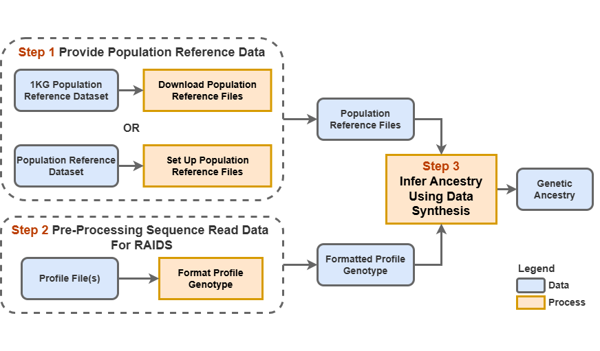
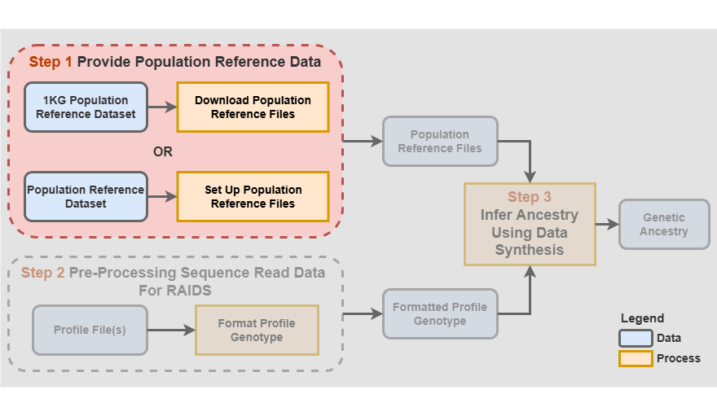

```{r style, echo=FALSE, results='hide', warning=FALSE, message=FALSE}
BiocStyle::markdown()

suppressPackageStartupMessages({
    library(knitr)
    library(RAIDS)
})

set.seed(121444)
```

<br />
**Package**: `r Rpackage("RAIDS")`<br />
**Authors**: `r packageDescription("RAIDS")[["Author"]]`<br />
**Version**: `r packageDescription("RAIDS")$Version`<br />
**Compiled date**: `r Sys.Date()`<br />
**License**: `r packageDescription("RAIDS")[["License"]]`<br />


# Licensing 

The `r Githubpkg("KrasnitzLab/RAIDS")` package and the underlying 
`r Githubpkg("KrasnitzLab/RAIDS")` code are distributed under  
the https://opensource.org/licenses/Apache-2.0 license. You are free to use and 
redistribute this software.  

<br>
<br>

# Citing

If you use the **RAIDS** package for a publication, we would ask you to cite 
the following:

> Pascal Belleau, Astrid Deschênes, Nyasha Chambwe, David A. Tuveson, Alexander Krasnitz; Genetic Ancestry Inference from Cancer-Derived Molecular Data across Genomic and Transcriptomic Platforms. Cancer Res 1 January 2023; 83 (1): 49–58. https://doi.org/10.1158/0008-5472.CAN-22-0682
<br>
<br>

# Introduction

The **RAIDS** (Robust Ancerstry Inference using Data Synthesis) package enables accurate and robust inference of genetic ancestry from human molecular data other than whole-genome or whole-exome sequences of cancer-free DNA. The current version can handle
sequences of:

* whole genomes
* whole exomes
* targeted gene panels 
* RNA,

including those from cancer-derived nucleic acids. The **RAIDS** package implements a 
data synthesis method that, for any given
molecular profile of an idividual, enables, on the one hand, profile-specific inference
parameter optimization and, on the other hand, a profile-specific inference
accuracy estimate. By the molecular profile we mean a table of the individual's 
germline genotypes at genome positions with sufficient read coverage in the 
individual's input data, where sequence variants are frequent in the population reference data. 

<br>
<br>

# Installation

To install this package 
from [Bioconductor](https://bioconductor.org/packages/RAIDS), start R 
(version 4.3 or later) and enter: 


```{r installDemo01, eval=FALSE, warning=FALSE, message=FALSE}
if (!requireNamespace("BiocManager", quietly = TRUE))
        install.packages("BiocManager")

BiocManager::install("RAIDS")
```

<br>
<br>

<a name="mains"></a>

# Using RAIDS: step-by-step explanation

This is an overview of the RAIDS inferential framework:

```{r graphMainSteps, echo=FALSE, fig.align="center", fig.cap="An overview of the genetic ancestry inference procedure.", out.width='130%', results='asis', warning=FALSE, message=FALSE}

```

The main steps are:

**Step 1.** Set-up working directory and provide population reference files

**Step 2** Sample the reference data for donors whose genotypes will be used for synthesis and optimize ancestry inference parameters using synthetic data

**Step 3** Infer ancestry

**Step 4** Summarize and visualize the results

These steps are described in detail in the following. 

<br>
<br>


## Step 1. Set-up working directory and provide population reference files


### 1.1 Create a working directory structure

First, the following working directory structure should be created:

```

#############################################################################
## Working directory structure
#############################################################################
workingDirectory/  
	data/  
		refGDS  
		profileGDS 

```

<br>

The following code creates a temporary working directory structure where the 
example will be run. 


```{r createDir, echo=TRUE, eval=TRUE, collapse=TRUE, warning=FALSE, message=FALSE}

#############################################################################
## Create a temporary working directory structure
##    using the tempdir() function
#############################################################################
pathWorkingDirectory <- file.path(tempdir(), "workingDirectory")
pathWorkingDirectoryData <- file.path(pathWorkingDirectory, "data")

if (!dir.exists(pathWorkingDirectory)) {
        dir.create(pathWorkingDirectory)
        dir.create(pathWorkingDirectoryData)
        dir.create(file.path(pathWorkingDirectoryData, "refGDS"))
        dir.create(file.path(pathWorkingDirectoryData, "profileGDS"))
}

```

<br>

### 1.2 Download the population reference files


The population reference files should be downloaded into the *data/refGDS* 
sub-directory. This following code downloads the complete pre-processed files 
for 1000 Genomes (1KG), for the hg38 build of the human genome, in the GDS 
format. The size of the 1KG GDS file is 15GB. 

```

#############################################################################
## How to download the pre-processed files for 1000 Genomes (1KG) (15 GB)
#############################################################################
cd workingDirectory
cd data/refGDS

wget https://labshare.cshl.edu/shares/krasnitzlab/aicsPaper/matGeno1000g.gds
wget https://labshare.cshl.edu/shares/krasnitzlab/aicsPaper/matAnnot1000g.gds
cd -

```

<br>

For illustrative purposes, a small 
**population reference GDS file** (called _ex1_good_small_1KG.gds_) and a small 
**population reference SNV Annotation GDS file** (called 
_ex1_good_small_1KG_Annot.gds_) are 
included in this package. Please note that these "mini-reference" files are for illustrative purposes only and cannot be used to infer genetic ancestry reliably.

In this example, the mini-reference files are copied to the 
*data/refGDS* directory.

```{r copyRefFile, echo=TRUE, eval=TRUE, collapse=TRUE, warning=FALSE, message=FALSE}

#############################################################################
## Load RAIDS package
#############################################################################
library(RAIDS)   

#############################################################################
## The population reference GDS file and SNV Annotation GDS file
##    need to be located in the same sub-directory.
## Note that the mini-reference GDS file used for this example is
##    NOT sufficient for reliable inference.
#############################################################################
## Path to the demo 1KG GDS file is located in this package
dataDir <- system.file("extdata", package="RAIDS")
pathReference <- file.path(dataDir, "tests")

fileGDS <- file.path(pathReference, "ex1_good_small_1KG.gds")
fileAnnotGDS <- file.path(pathReference, "ex1_good_small_1KG_Annot.gds")

file.copy(fileGDS, file.path(pathWorkingDirectoryData, "refGDS"))
file.copy(fileAnnotGDS, file.path(pathWorkingDirectoryData, "refGDS"))

```
<br>
<br>

## Step 2 Ancestry inference with RAIDS

### 2.1 Set-up the required directories

All required directories are created at this point. In addition, the paths to 
the reference files are stored in variables for later use.

```{r installRaids, echo=TRUE, eval=TRUE, collapse=TRUE, warning=FALSE, message=FALSE}

#############################################################################
## The file path to the population reference GDS file 
##     is required (refGenotype will be used as input later)
## The file path to the population reference SNV Annotation GDS file
##     is also required (refAnnotation will be used as input later)
#############################################################################
pathReference <- file.path(pathWorkingDirectoryData, "refGDS")

refGenotype <- file.path(pathReference, "ex1_good_small_1KG.gds")
refAnnotation <- file.path(pathReference, "ex1_good_small_1KG_Annot.gds")

#############################################################################
## The output profileGDS directory, inside workingDirectory/data, must be 
##    created (pathProfileGDS will be used as input later)
#############################################################################
pathProfileGDS <- file.path(pathWorkingDirectoryData, "profileGDS")

if (!dir.exists(pathProfileGDS)) {
    dir.create(pathProfileGDS)
}

```


<br>

### 2.2 Sample the reference data for donors whose genotypes will be used for synthesis and optimize ancestry inference parameters using synthetic data

With the 1KG reference, we recommend sampling 30 donor profiles per 
sub-continental population. 
For reproducibility, be sure to use the same random-number generator seed.

In the following code, only 2 individual profiles per 
sub-continental population are sampled from the 
demo population GDS file:

```{r samplingProfiles, echo=TRUE, eval=TRUE, collapse=TRUE, warning=FALSE, message=FALSE}

#############################################################################
## Set up the following random number generator seed to reproduce  
##    the expected results
#############################################################################
set.seed(3043)

#############################################################################
## Choose the profiles from the population reference GDS file for 
##   data synthesis.
## Here we choose 2 profiles per subcontinental population 
##   from the mini 1KG GDS file.
## Normally, we would use 30 randomly chosen profiles per 
##   subcontinental population.
#############################################################################
dataRef <- select1KGPopForSynthetic(fileReferenceGDS=refGenotype,
                                        nbProfiles=2L)

```


<br>

### 2.3 Infer ancestry

Within a single function call, data synthesis is performed, the synthetic 
data are used to optimize the inference parameters and, with these, the 
ancestry is inferred from the input sequence profile.

According to the type of input data (RNA or DNA sequence), a specific function 
should be called. The *inferAncestry()* function (*inferAncestryDNA()* is 
the same as *inferAncestry()* ) is used for DNA profiles while 
the *inferAncestryGeneAware()* function is RNA specific.

The *inferAncestry()* function requires a specific input format for the individual's 
genotyping profile as explained in the Introduction. The format is set by 
the *genoSource* parameter. 

One of the allowed formats is VCF (*genoSource=c("VCF")*), with the following 
mandatory fields: _GT_, _AD_ and _DP_. 
The VCF file must be gzipped.

Also allowed is a  "generic" file format  (*genoSource=c("generic")*), specified as 
a comma-separated table The following columns are mandatory:

* _Chromosome_: The name of the chromosome can be formatted as chr1 or 1
* _Position_: The position on the chromosome
* _Ref_: The reference nucleotide
* _Alt_: The alternative nucleotide
* _Count_: The total read count
* _File1R_: Read count for the reference nucleotide
* _File1A_: Read count for the alternative nucleotide
 
Note: a header with identical column names is required.

In this example, the profile is from DNA source and requires the use of the 
*inferAncestry()* function.


```{r infere, echo=TRUE, eval=TRUE, collapse=TRUE, warning=FALSE, message=FALSE}

###########################################################################
## GenomeInfoDb and BSgenome are required libraries to run this example
###########################################################################
if (requireNamespace("GenomeInfoDb", quietly=TRUE) &&
      requireNamespace("BSgenome.Hsapiens.UCSC.hg38", quietly=TRUE)) {

    #######################################################################
    ## Chromosome length information is required
    ## chr23 is chrX, chr24 is chrY and chrM is 25
    #######################################################################
    genome <- BSgenome.Hsapiens.UCSC.hg38::Hsapiens
    chrInfo <- GenomeInfoDb::seqlengths(genome)[1:25]

    #######################################################################
    ## The demo SNP VCF file of the DNA profile donor
    #######################################################################
    fileDonorVCF <- file.path(dataDir, "example", "snpPileup", "ex1.vcf.gz")

    #######################################################################
    ## The ancestry inference call
    #######################################################################
    resOut <- inferAncestry(profileFile=fileDonorVCF, 
        pathProfileGDS=pathProfileGDS,
        fileReferenceGDS=refGenotype,
        fileReferenceAnnotGDS=refAnnotation,
        chrInfo=chrInfo,
        syntheticRefDF=dataRef,
        genoSource=c("VCF"))
}

```


The temporary files created in this example are deleted as follows.

```{r removeTmp, echo=TRUE, eval=TRUE, collapse=TRUE, warning=FALSE, message=FALSE}

#######################################################################
## Remove temporary files created for this demo
#######################################################################
unlink(pathWorkingDirectory, recursive=TRUE, force=TRUE)
      
```

<br>
<br>


## Step 3. Examine the value of the inference call

The inferred ancestry and the optimal parameters are present in the *list* 
object generated by the *inferAncestry()* and *inferAncestryGeneAware()* 
functions.


```{r printRes, echo=TRUE, eval=TRUE, collapse=TRUE, warning=FALSE, message=FALSE}

###########################################################################
## The output is a list object with multiple entries
###########################################################################
class(resOut)
names(resOut)

```


<br>

### 3.1 Inspect the inference and the optimal parameters


Global ancestry is inferred using principal-component decomposition
followed by nearest neighbor classification. Two parameters are defined and optimized: 
*D*, the number of the top principal directions retained and *k*, the number of nearest 
neighbors.  

The results of the inference are provided as the *Ancestry* item in the *resOut* list. 
It is a *data.frame* with the following columns:

* _sample.id_: The unique identifier of the sample 
* _D_: The optimal *D* inference parameter
* _k_: The optimal *k* inference parameter
* _SuperPop_: The inferred ancestry


```{r print, echo=TRUE, eval=TRUE, collapse=TRUE, warning=FALSE, message=FALSE}

###########################################################################
## The ancestry information is stored in the 'Ancestry' entry 
###########################################################################
print(resOut$Ancestry)

```

<br>

### 3.2 Visualize the RAIDS performance for the synthetic data


The *createAUROCGraph()* function enable the visualization of RAIDS 
performance for the synthetic data, as a function of *D* and *k*.

```{r visualize, echo=TRUE, eval=TRUE, fig.align="center", fig.cap="RAIDS performance for the synthtic data.", results='asis', collapse=FALSE, warning=FALSE, message=FALSE}

###########################################################################
## Create a graph showing the perfomance for the synthetic data
## The output is a ggplot object
###########################################################################
createAUROCGraph(dfAUROC=resOut$paraSample$dfAUROC, title="Example ex1")

```

In this illustrative example, the performance estimates are lower than expected 
with a realistic sequence profile and a complete reference population file.

<br>
<br>

# Format population reference dataset (optional)


```{r graphStep1, echo=FALSE, fig.align="center", fig.cap="Step 1 - Provide population reference data", out.width='120%', results='asis', warning=FALSE, message=FALSE}

```


A population reference dataset with known ancestry is required to infer 
ancestry. 

Three important reference files, containing formatted information about 
the reference dataset, are required:

- The population reference GDS File
- The population reference SNV Annotation GDS file
- The population reference SNV Retained VCF file (optional)


The formats of those files are described in 
the [Population reference dataset GDS files](Create_Reference_GDS_File.html) 
vignette.

<span style="color:darkred;font-weight:bold">The reference files associated to 
the Cancer Research associated paper are available. Note that these 
pre-processed files are for 1000 Genomes (1KG), in hg38. The files are 
available here:</span>

<span style="color:red">
[https://labshare.cshl.edu/shares/krasnitzlab/aicsPaper](https://labshare.cshl.edu/shares/krasnitzlab/aicsPaper)
</span>

<span style="color:darkred;font-weight:bold">The size of the 1KG GDS file 
is 15GB.</span>

<span style="color:darkred;font-weight:bold">The 1KG GDS file is mapped on 
hg38 [@Lowy-Gallego2019a].</span>

<span style="color:darkred;font-weight:bold">This section can be skipped if 
you choose to use the pre-processed files.</span>

<br>
<br>


# Session info

Here is the output of `sessionInfo()` in the environment in which this 
document was compiled:

```{r sessionInfo, echo=FALSE}
sessionInfo()
```

<br>
<br>


# References

