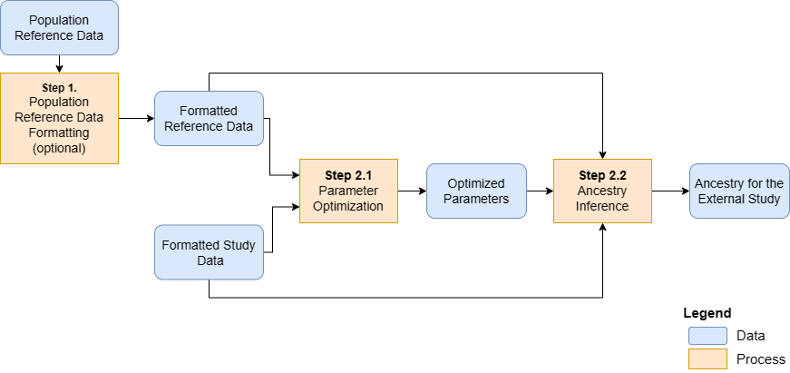

```{r style, echo=FALSE, results='hide', warning=FALSE, message=FALSE}
BiocStyle::markdown()

suppressPackageStartupMessages({
    library(knitr)
    library(RAIDS)
    library(gdsfmt)
})

set.seed(121444)
```

<br />
**Package**: `r Rpackage("RAIDS")`<br />
**Authors**: `r packageDescription("RAIDS")[["Author"]]`<br />
**Version**: `r packageDescription("RAIDS")$Version`<br />
**Compiled date**: `r Sys.Date()`<br />
**License**: `r packageDescription("RAIDS")[["License"]]`<br />


# Licensing 

The `r Githubpkg("KrasnitzLab/RAIDS")` package and the underlying 
`r Githubpkg("KrasnitzLab/RAIDS")` code are distributed under  
the https://opensource.org/licenses/Apache-2.0 license. You are free to use and 
redistribute this software.  

<br>
<br>

# Citing

If you use the **RAIDS** package for a publication, we would ask you to cite 
the following:

> Pascal Belleau, Astrid Deschênes, Nyasha Chambwe, David A. Tuveson, Alexander Krasnitz; Genetic Ancestry Inference from Cancer-Derived Molecular Data across Genomic and Transcriptomic Platforms. Cancer Res 1 January 2023; 83 (1): 49–58. https://doi.org/10.1158/0008-5472.CAN-22-0682
<br>
<br>

# Introduction

Multiple methods have been implemented to infer ancestry from germline DNA 
sequence [@Price2006; @Pritchard2000; @Alexander2009]. However, genotyping of 
DNA from matched normal specimens is not part of standard clinical practice
and is not performed routinely outside academic clinical centers. 
In sum, matched germline DNA sequence is often missing for cancer-derived 
molecular data. In such cases, having the possibility to infer ancestry 
from tumor-derived data would be beneficial.

The **RAIDS** package implements an inference procedure that has been
specifically developed to accurately infer genetic ancestry from 
cancer-derived sequences. The current version can handle cancer-derived 
sequences of:

* tumor exomes
* targeted gene panels 
* RNA

The **RAIDS** package implements a data synthesis method that, for any given
cancer-derived sequence profile, enables 
on the one hand, profile-specific inference
parameter optimization and on the other hand, a profile-specific inference
accuracy estimate.

<br>
<br>

# Installation

To install the latest version from the 
[RAIDS Github Website](https://github.com/KrasnitzLab/RAIDS "RAIDS Github Site"), 
the `r CRANpkg("devtools")` package is required.

```{r installDemo01, eval=FALSE, warning=FALSE, message=FALSE}
## Load required package
library(devtools)

## Install the latest version of RAIDS
devtools::install_github('KrasnitzLab/RAIDS')
```

<br>
<br>

<a name="mains"></a>

# Main Steps


This is an overview of genetic ancestry inference from cancer-derived 
molecular data:

```{r graphMainSteps, echo=FALSE, fig.align="center", fig.cap="An overview of the genetic ancestry inference process.", out.width='120%', results='asis', warning=FALSE, message=FALSE}

```

The main steps are:

**Step 1.** Format reference data from the population reference dataset (optional)

**Step 2.1** Optimize ancestry inference parameters

**Step 2.2** Infer ancestry for the subjects of the external study

These steps are described in detail in the following.

<br>
<br>

## Step 1 - Format population reference dataset (optional)


```{r graphStep1, echo=FALSE, fig.align="center", fig.cap="Step 1 - Formatting the information from the population reference dataset (optional)", out.width='120%', results='asis', warning=FALSE, message=FALSE}
knitr::include_graphics("MainSteps_Step1_v04.png")
```


******

At this step three important reference files are created:

- The population reference GDS File
- The population reference SNV Annotation GDS file
- The population reference SNV Retained VCF file

<span style="color:darkred;font-weight:bold">The reference files associated to 
the Cancer Research associated paper are available. Note that these 
pre-processed files are for 1000 Genomes (1KG), in hg38. The files are 
available here:</span>

<span style="color:red">
[https://labshare.cshl.edu/shares/krasnitzlab/aicsPaper](https://labshare.cshl.edu/shares/krasnitzlab/aicsPaper)
</span>

<span style="color:darkred;font-weight:bold">The size of the 1KG GDS file 
is 15GB.</span>

<span style="color:darkred;font-weight:bold">The 1KG GDS file is mapped on 
hg38 [@Lowy-Gallego2019a].</span>

<span style="color:darkred;font-weight:bold">This section can be skipped if 
you choose to use the pre-processed files.</span>

The execution of this step is explained in the [Formatting the information from the population reference dataset (optional)](Create_1KG_GDS_file.html) 
vignette.

<br>


## Step 2 - Wrapper function to run ancestry inference in one command

The final step can be run with a wrapper function
that encapsulates multiple steps of the workflow.

```{r graphWrapper, echo=FALSE, fig.align="center", fig.cap="Final step - The wrapper function encapsulates multiple steps of the workflow.", out.width='120%', results='asis', warning=FALSE, message=FALSE}
knitr::include_graphics("MainSteps_Wrapper_v04.png")
```
 
In summary, the wrapper function generates the synthetic dataset and uses it 
to selected the optimal parameters before calling the genetic ancestry on 
the current profiles.

<br>

The wrapper function, called _runExomeAncestry()_, requires 4 files as input:

- The **population reference GDS file**
- The **population reference SNV Annotation GDS file**
- The **Profile SNP pileup file** (one per sample present in the study)
- The **Profile PED RDS file** (one file with information for all profiles in the study)

A *data.frame* containing the general information about the study is 
also required. The *data.frame* must contain those 3 columns:

- _study.id_: The study identifier (example: TCGA-BRCA).
- _study.desc_: The description of the study.
- _study.platform_: The type of sequencing (example: RNA-seq).

The required **population reference GDS file** and 
**population reference SNV Annotation GDS file** should be stored in the same
directory. In the example below, this directory is referred to 
as **pathReference**.

The generic **Profile SNP pileup file** format is coma separated and the 
mandatory columns are:

* _Chromosome_: The name of the chromosome
* _Position_: The position on the chromosome
* _Ref_: The reference nucleotide
* _Alt_: The aternative nucleotide
* _Count_: The total count
* _File1R_: The count for the reference nucleotide
* _File1A_: The count for the alternative nucleotide

Beware that the starting position in the **population reference GDS File** is 
zero (like BED files). The **Profile SNP pileup file** should also start 
at position zero.

Note that the name assigned to the **Profile SNP pileup file** has to 
correspond to the profile identifier (Name.ID) in the following analysis. 
For example, a SNP pileup file called "Sample.01.txt.gz" would be 
associated to the "Sample.01" profile.

The **Profile PED RDS file** must contain a *data.frame* describing all 
the profiles to be analyzed. These 5 mandatory columns: 

- _Name.ID_: The unique sample identifier. The profile VCF file  
should be called "Name.ID.txt.gz". 
- _Case.ID_: The patient identifier associated to the sample.
- _Sample.Type_: The information about the profile tissue source 
(primary tumor, metastatic tumor, normal, etc..). 
- _Diagnosis_: The donor's diagnosis.
- _Source_: The source of the profile sequence data (example: dbGAP_XYZ).

Important: The row names of the *data.frame* must be the profiles' **Name.ID**.

This file is referred to as the **Profile PED RDS file** (PED for pedigree). 
Alternatively, the PED information can be saved in another type of 
file (CVS, etc..) as long as the *data.frame* information can be regenerated 
in R (with _read.csv()_ or else). 

```{r runExomeAncestry, echo=TRUE, eval=TRUE, collapse=TRUE, warning=FALSE, message=FALSE}
#############################################################################
## Load required packages
#############################################################################
library(RAIDS)    
library(gdsfmt)

## Path to the demo 1KG GDS file is located in this package
dataDir <- system.file("extdata", package="RAIDS")

#############################################################################
## The path and file name for the PED RDS file
## will the information about the analyzed samples
#############################################################################
filePED <- file.path(dataDir, "example", "pedEx.rds")
ped <- readRDS(filePED)
head(ped)

#############################################################################
## The population reference GDS file and SNV Annotation GDS file
## need to be located in the same directory.
## Note that the population reference GDS file used for this example is a
## simplified version and CANNOT be used for any real analysis
#############################################################################
pathReference <- file.path(dataDir, "example", "gdsRef")

fileGDS <- file.path(pathReference, "ex1kg.gds")
fileAnnotGDS <- file.path(pathReference, "exAnnot1kg.gds")

#############################################################################
## A data frame containing general information about the study
## is also required. The data frame must have
## those 3 columns: "study.id", "study.desc", "study.platform"
#############################################################################
studyDF <- data.frame(study.id="MYDATA",
                   study.desc="Description",
                   study.platform="PLATFORM",
                   stringsAsFactors=FALSE)

#############################################################################
## The Sample SNP pileup files (one per sample) need
## to be all located in the same directory.
#############################################################################
pathGeno <- file.path(dataDir, "example", "snpPileup")

#############################################################################
## Fix RNG seed to ensure reproducible results
#############################################################################
set.seed(3043)

#############################################################################
## Select the profiles from the population reference GDS file for 
## the synthetic data.
## Here we select 2 profiles from the simplified 1KG GDS for each 
## subcontinental-level.
## Normally, we use 30 profile for each 
## subcontinental-level but it is too big for the example.
## The 1KG files in this example only have 6 profiles for each 
## subcontinental-level (for demo purpose only).
#############################################################################
gds1KG <- snpgdsOpen(fileGDS)
dataRef <- select1KGPop(gds1KG, nbProfiles=2L)
closefn.gds(gds1KG)

## Chromosome length information for hg38
## chrInfo[23] is chrX, chrInfo[24] is chrY and chrM is chrInfo[25]
chrInfo <- c(248956422L, 242193529L, 198295559L, 190214555L,
 181538259L, 170805979L, 159345973L, 145138636L, 138394717L, 133797422L,
 135086622L, 133275309L, 114364328L, 107043718L, 101991189L, 90338345L,
 83257441L,  80373285L,  58617616L,  64444167L,  46709983L, 50818468L,
 156040895L, 57227415L,  16569L)

#############################################################################
## The path where the Sample GDS files (one per sample)
## will be created needs to be specified.
#############################################################################
pathProfileGDS <- file.path(getwd(), "example", "out.tmp")

#############################################################################
## The path where the result files will be created needs to 
## be specified
#############################################################################
pathOut <- file.path(getwd(), "example", "res.out")

## Example can only be run if the current directory is in writing mode
if (file.access(getwd()) == 0 && !dir.exists(file.path(getwd(), "example"))) {

    dir.create(file.path(getwd(), "example"))
    dir.create(pathProfileGDS)
    dir.create(pathOut)
    
    #########################################################################
    ## The wrapper function generates the synthetic dataset and uses it 
    ## to selected the optimal parameters before calling the genetic 
    ## ancestry on the current profiles.
    ## All important information, for each step, are saved in 
    ## multiple output files.
    ## The 'genoSource' parameter has 2 options depending on how the 
    ##   SNP pileup files have been generated: 
    ##      "snp-pileup" (snp-pileup software) or "generic" (other software)
    #########################################################################
    runExomeAncestry(pedStudy=ped, studyDF=studyDF,
                 pathProfileGDS=pathProfileGDS,
                 pathGeno=pathGeno,
                 pathOut=pathOut,
                 fileReferenceGDS=fileGDS,
                 fileReferenceAnnotGDS=fileAnnotGDS,
                 chrInfo=chrInfo,
                 syntheticRefDF=dataRef,
                 genoSource="snp-pileup")
    list.files(pathOut)
    list.files(file.path(pathOut, ped$Name.ID[1]))

    #########################################################################
    ## The file containing the ancestry inference (SuperPop column) and 
    ## optimal number of PCA component (D column)
    ## optimal number of neighbours (K column)
    #########################################################################
    resAncestry <- read.csv(file.path(pathOut, 
                                    paste0(ped$Name.ID[1], ".Ancestry.csv")))
    resAncestry

    ## Remove temporary files created for this demo
    unlink(pathProfileGDS, recursive=TRUE, force=TRUE)
    unlink(pathOut, recursive=TRUE, force=TRUE)
    unlink(file.path(getwd(), "example"), force=TRUE)
}

```

<br>
<br>

The *runExomeAncestry()* function generates 3 types of files 
in the *pathOut* directory.

* The ancestry inference CSV file (**".Ancestry.csv"** file) 
* The inference information RDS file (**".infoCall.rds"** file)
* The parameter information RDS files from the synthetic inference (**"KNN.synt.*.rds"** files in a sub-directory)

In addition, a sub-directory (named using the *profile ID*) is 
also created. 


<br>
<br>


# Pre-processed reference files are available for 1000 Genomes (1KG) in hg38

Pre-processed files, such as the 1KG GDS file, are available at this address:

[https://labshare.cshl.edu/shares/krasnitzlab/aicsPaper](https://labshare.cshl.edu/shares/krasnitzlab/aicsPaper)

Beware that some of these files are large.

<br>
<br>


# Session info

Here is the output of `sessionInfo()` in the environment in which this 
document was compiled:

```{r sessionInfo, echo=FALSE}
sessionInfo()
```

<br>
<br>


# References

