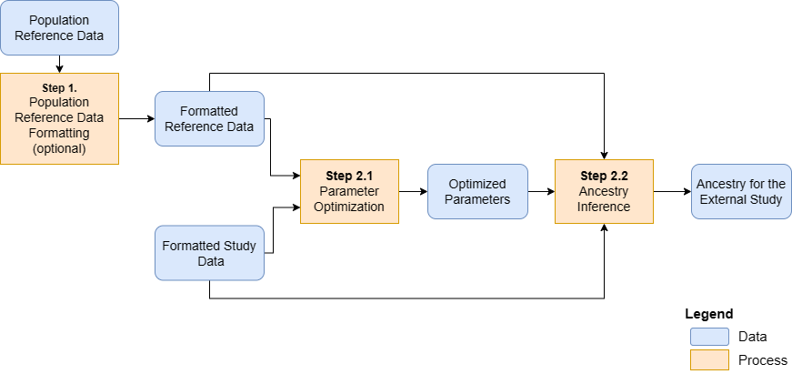
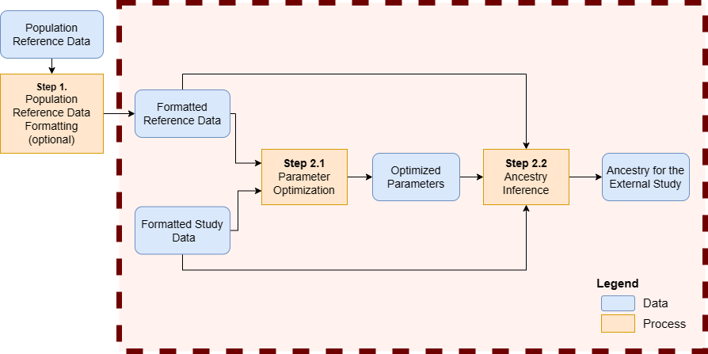
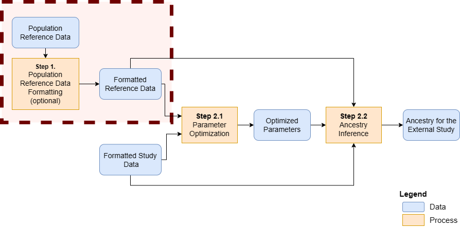

```{r style, echo=FALSE, results='hide', warning=FALSE, message=FALSE}
BiocStyle::markdown()

suppressPackageStartupMessages({
    library(knitr)
    library(RAIDS)
    library(gdsfmt)
})

set.seed(121444)
```

<br />
**Package**: `r Rpackage("RAIDS")`<br />
**Authors**: `r packageDescription("RAIDS")[["Author"]]`<br />
**Version**: `r packageDescription("RAIDS")$Version`<br />
**Compiled date**: `r Sys.Date()`<br />
**License**: `r packageDescription("RAIDS")[["License"]]`<br />


<br>
<br>


This vignette explains, in further details, the used of the wrapper functions 
that were developed for a previous release of RAIDS.

<span style="color:darkred;font-weight:bold">While those functions are still 
working, we recommend using the new functions as described in the main 
vignette.</span>

<br>
<br>

# Main Steps


This is an overview of genetic ancestry inference from cancer-derived 
molecular data:

```{r graphMainSteps, echo=FALSE, fig.align="center", fig.cap="An overview of the genetic ancestry inference process.", out.width='130%', results='asis', warning=FALSE, message=FALSE}

```

The main steps are:

**Step 1.** Format reference data from the population reference dataset (optional)

**Step 2.1** Optimize ancestry inference parameters

**Step 2.2** Infer ancestry for the subjects of the external study

These steps are described in detail in the following. Steps 2.1 and 2.2 can be 
run together using one wrapper function.

<br>
<br>


## Main Step - Ancestry Inference

A wrapper function encapsulates multiple steps of the workflow. 

```{r graphWrapper, echo=FALSE, fig.align="center", fig.cap="Final step - The wrapper function encapsulates multiple steps of the workflow.", out.width='120%', results='asis', warning=FALSE, message=FALSE}

```

In summary, the wrapper function generates the synthetic dataset and uses 
it to selected the optimal parameters before calling the genetic ancestry 
on the current profiles.

According to the type of input data (RNA or DNA), a specific wrapper function 
is available.

<br>

### DNA Data - Wrapper function to run ancestry inference on DNA data

The wrapper function, called _runExomeAncestry()_, requires 4 files as input:

- The **population reference GDS file**
- The **population reference SNV Annotation GDS file**
- The **Profile SNP file** (one per sample present in the study)
- The **Profile PED RDS file** (one file with information for all 
profiles in the study)

In addition, a *data.frame* containing the general information about the 
study is also required. The *data.frame* must contain those 3 columns:

- _study.id_: The study identifier (example: TCGA-BRCA).
- _study.desc_: The description of the study.
- _study.platform_: The type of sequencing (example: RNA-seq).

<br>

#### **Population reference files**

For demonstration purpose, a small 
**population reference GDS file** (called _ex1_good_small_1KG.gds_) and a small 
**population reference SNV Annotation GDS file** (called 
_ex1_good_small_1KG_Annot.gds_) are 
included in this package. Beware that those two files should not be used to 
run a real ancestry inference.The results obtained with those files won't be 
reliable.

The required **population reference GDS file** and 
**population reference SNV Annotation GDS file** should be stored in the same
directory. In the example below, this directory is referred to 
as **pathReference**. 

<br>

#### **Profile SNP file**

The **Profile SNP file** can be either in a VCF format or in a generic format.

The **Profile SNP VCF file**  follows the VCF standard with at least 
those genotype fields: _GT_, _AD_ and _DP_. The identifier of the genotype 
in the VCF file must correspond to the profile identifier _Name.ID_. 
The SNVs  must be germline variants and should include the genotype of the 
wild-type homozygous at the selected positions in the reference. One file per
profile is need and the VCF file must be gzipped.

Note that the name assigned to the **Profile SNP VCF file** has to 
correspond to the profile identifier _Name.ID_ in the following analysis. 
For example, a SNP file called "Sample.01.vcf.gz" would be 
associated to the "Sample.01" profile.

A generic SNP file can replace the VCF file. The **Profile SNP Generic file** 
format is coma separated and the mandatory columns are:

* _Chromosome_: The name of the chromosome
* _Position_: The position on the chromosome
* _Ref_: The reference nucleotide
* _Alt_: The aternative nucleotide
* _Count_: The total count
* _File1R_: The count for the reference nucleotide
* _File1A_: The count for the alternative nucleotide

Beware that the starting position in the **population reference GDS File** is 
zero (like BED files). The **Profile SNP Generic file** should also start 
at position zero.

Note that the name assigned to the **Profile SNP Generic file** has to 
correspond to the profile identifier _Name.ID_ in the following analysis. 
For example, a SNP file called "Sample.01.generic.txt.gz" would be 
associated to the "Sample.01" profile.

<br>

#### **Profile PED RDS file**

The **Profile PED RDS file** must contain a *data.frame* describing all 
the profiles to be analyzed. These 5 mandatory columns: 

- _Name.ID_: The unique sample identifier. The associated **profile SNP file** 
should be called "Name.ID.txt.gz". 
- _Case.ID_: The patient identifier associated to the sample.
- _Sample.Type_: The information about the profile tissue source 
(primary tumor, metastatic tumor, normal, etc..). 
- _Diagnosis_: The donor's diagnosis.
- _Source_: The source of the profile sequence data (example: dbGAP_XYZ).

Important: The row names of the *data.frame* must be the profiles *Name.ID*.

This file is referred to as the **Profile PED RDS file** (PED for pedigree). 
Alternatively, the PED information can be saved in another type of 
file (CVS, etc..) as long as the *data.frame* information can be regenerated 
in R (with _read.csv()_ or else). 

<br>

#### **Example**

This example run an ancestry inference on an exome sample. Both population 
reference files are demonstration files and should not be 
used for a real ancestry inference. Beware that running an ancestry inference 
on real data will take longer to run.

```{r runExomeAncestry, echo=TRUE, eval=TRUE, collapse=FALSE, warning=FALSE, message=FALSE}
#############################################################################
## Load required packages
#############################################################################
library(RAIDS)    
library(gdsfmt)

## Path to the demo 1KG GDS file is located in this package
dataDir <- system.file("extdata", package="RAIDS")

#############################################################################
## Load the information about the profile
#############################################################################
data(demoPedigreeEx1)
head(demoPedigreeEx1)

#############################################################################
## The population reference GDS file and SNV Annotation GDS file
## need to be located in the same directory.
## Note that the population reference GDS file used for this example is a
## simplified version and CANNOT be used for any real analysis
#############################################################################
pathReference <- file.path(dataDir, "tests")

fileGDS <- file.path(pathReference, "ex1_good_small_1KG.gds")
fileAnnotGDS <- file.path(pathReference, "ex1_good_small_1KG_Annot.gds")

#############################################################################
## A data frame containing general information about the study
## is also required. The data frame must have
## those 3 columns: "study.id", "study.desc", "study.platform"
#############################################################################
studyDF <- data.frame(study.id="MYDATA",
                   study.desc="Description",
                   study.platform="PLATFORM",
                   stringsAsFactors=FALSE)

#############################################################################
## The Sample SNP VCF files (one per sample) need
## to be all located in the same directory.
#############################################################################
pathGeno <- file.path(dataDir, "example", "snpPileup")

#############################################################################
## Fix RNG seed to ensure reproducible results
#############################################################################
set.seed(3043)

#############################################################################
## Select the profiles from the population reference GDS file for 
## the synthetic data.
## Here we select 2 profiles from the simplified 1KG GDS for each 
## subcontinental-level.
## Normally, we use 30 profile for each 
## subcontinental-level but it is too big for the example.
## The 1KG files in this example only have 6 profiles for each 
## subcontinental-level (for demo purpose only).
#############################################################################
gds1KG <- snpgdsOpen(fileGDS)
dataRef <- select1KGPop(gds1KG, nbProfiles=2L)
closefn.gds(gds1KG)

## Seqinfo and BSgenome are required libraries to run this example
if (requireNamespace("Seqinfo", quietly=TRUE) &&
      requireNamespace("BSgenome.Hsapiens.UCSC.hg38", quietly=TRUE)) {

    ## Chromosome length information
    ## chr23 is chrX, chr24 is chrY and chrM is 25
    chrInfo <- Seqinfo::seqlengths(BSgenome.Hsapiens.UCSC.hg38::Hsapiens)[1:25]

    ###########################################################################
    ## The path where the Sample GDS files (one per sample)
    ## will be created needs to be specified.
    ###########################################################################
    pathProfileGDS <- file.path(tempdir(), "exampleDNA", "out.tmp")

    ###########################################################################
    ## The path where the result files will be created needs to 
    ## be specified
    ###########################################################################
    pathOut <- file.path(tempdir(), "exampleDNA", "res.out")

    ## Example can only be run if the current directory is in writing mode
    if (!dir.exists(file.path(tempdir(), "exampleDNA"))) {

        dir.create(file.path(tempdir(), "exampleDNA"))
        dir.create(pathProfileGDS)
        dir.create(pathOut)
    
        #########################################################################
        ## The wrapper function generates the synthetic dataset and uses it 
        ## to selected the optimal parameters before calling the genetic 
        ## ancestry on the current profiles.
        ## All important information, for each step, are saved in 
        ## multiple output files.
        ## The 'genoSource' parameter has 2 options depending on how the 
        ##   SNP files have been generated: 
        ##   SNP VCF files have been generated: 
        ##  "VCF" or "generic" (other software)
        ##
        #########################################################################
        runExomeAncestry(pedStudy=demoPedigreeEx1, studyDF=studyDF,
                 pathProfileGDS=pathProfileGDS,
                 pathGeno=pathGeno,
                 pathOut=pathOut,
                 fileReferenceGDS=fileGDS,
                 fileReferenceAnnotGDS=fileAnnotGDS,
                 chrInfo=chrInfo,
                 syntheticRefDF=dataRef,
                 genoSource="VCF")
        list.files(pathOut)
        list.files(file.path(pathOut, demoPedigreeEx1$Name.ID[1]))

        #######################################################################
        ## The file containing the ancestry inference (SuperPop column) and 
        ## optimal number of PCA component (D column)
        ## optimal number of neighbours (K column)
        #######################################################################
        resAncestry <- read.csv(file.path(pathOut, 
                        paste0(demoPedigreeEx1$Name.ID[1], ".Ancestry.csv")))
        print(resAncestry)

        ## Remove temporary files created for this demo
        unlink(pathProfileGDS, recursive=TRUE, force=TRUE)
        unlink(pathOut, recursive=TRUE, force=TRUE)
        unlink(file.path(tempdir(), "exampleDNA"), recursive=TRUE, force=TRUE)
    }
}
  

```

<br>
<br>

The *runExomeAncestry()* function generates 3 types of files 
in the *pathOut* directory.

* The ancestry inference CSV file (**".Ancestry.csv"** file) 
* The inference information RDS file (**".infoCall.rds"** file)
* The parameter information RDS files from the synthetic inference 
(__"KNN.synt.__*__.rds"__ files in a sub-directory)

In addition, a sub-directory (named using the *profile ID*) is 
also created. 

The inferred ancestry is stored in the ancestry inference CSV 
file (**".Ancestry.csv"** file) which also contains those columns:

* _sample.id_: The unique identifier of the sample 
* _D_: The optimal PCA dimension value used to infer the ancestry
* _k_: The optimal number of neighbors value used to infer the ancestry
* _SuperPop_: The inferred ancestry

<br>
<br>


### RNA data - Wrapper function to run ancestry inference on RNA data 

The process is the same as for the DNA but use the wrapper function 
called _runRNAAncestry()_. Internally the data is process differently.
It requires 4 files as input:

- The **population reference GDS file**
- The **population reference SNV Annotation GDS file**
- The **Profile SNP file** (one per sample present in the study)
- The **Profile PED RDS file** (one file with information for all 
profiles in the study)

A *data.frame* containing the general information about the study is 
also required. The *data.frame* must contain those 3 columns:

- _study.id_: The study identifier (example: TCGA-BRCA).
- _study.desc_: The description of the study.
- _study.platform_: The type of sequencing (example: RNA-seq).

<br>

#### **Population reference files**

For demonstration purpose, a small 
**population reference GDS file** (called _ex1_good_small_1KG.gds_) and a small 
**population reference SNV Annotation GDS file** (called 
_ex1_good_small_1KG_Annot.gds_) are 
included in this package. Beware that those two files should not be used to 
run a real ancestry inference.The results obtained with those files won't be 
reliable.

The required **population reference GDS file** and 
**population reference SNV Annotation GDS file** should be stored in the same
directory. In the example below, this directory is referred to 
as **pathReference**.

<br>

#### **Profile SNP file**

The **Profile SNP file** can be either in a VCF format or in a generic format.

The **Profile SNP VCF file**  follows the VCF standard with at least 
those genotype fields: _GT_, _AD_ and _DP_. The identifier of the genotype 
in the VCF file must correspond to the profile identifier _Name.ID_. 
The SNVs  must be germline variants and should include the genotype of the 
wild-type homozygous at the selected positions in the reference. One file per
profile is need and the VCF file must be gzipped.

Note that the name assigned to the **Profile SNP VCF file** has to 
correspond to the profile identifier _Name.ID_ in the following analysis. 
For example, a SNP file called "Sample.01.vcf.gz" would be 
associated to the "Sample.01" profile.

A generic SNP file can replace the VCF file. The **Profile SNP Generic file** 
format is coma separated and the mandatory columns are:

* _Chromosome_: The name of the chromosome
* _Position_: The position on the chromosome
* _Ref_: The reference nucleotide
* _Alt_: The aternative nucleotide
* _Count_: The total count
* _File1R_: The count for the reference nucleotide
* _File1A_: The count for the alternative nucleotide

Beware that the starting position in the **population reference GDS File** is 
zero (like BED files). The **Profile SNP Generic file** should also start 
at position zero.

Note that the name assigned to the **Profile SNP Generic file** has to 
correspond to the profile identifier _Name.ID_ in the following analysis. 
For example, a SNP file called "Sample.01.generic.txt.gz" would be 
associated to the "Sample.01" profile.

<br>

#### **Profile PED RDS file**

The **Profile PED RDS file** must contain a *data.frame* describing all 
the profiles to be analyzed. These 5 mandatory columns: 

- _Name.ID_: The unique sample identifier. The associated **profile SNP file**  
should be called "Name.ID.txt.gz". 
- _Case.ID_: The patient identifier associated to the sample.
- _Sample.Type_: The information about the profile tissue source 
(primary tumor, metastatic tumor, normal, etc..). 
- _Diagnosis_: The donor's diagnosis.
- _Source_: The source of the profile sequence data (example: dbGAP_XYZ).

Important: The row names of the *data.frame* must be the profiles _Name.ID_.

This file is referred to as the **Profile PED RDS file** (PED for pedigree). 
Alternatively, the PED information can be saved in another type of 
file (CVS, etc..) as long as the *data.frame* information can be regenerated 
in R (with _read.csv()_ or else). 

<br>

#### **Example**

This example run an ancestry inference on an RNA sample. Both population 
reference files are demonstration files and should not be 
used for a real ancestry inference. Beware that running an ancestry inference 
on real data will take longer to run.

```{r runRNAAncestry, echo=TRUE, eval=TRUE, collapse=FALSE, warning=FALSE, message=FALSE}
#############################################################################
## Load required packages
#############################################################################
library(RAIDS)    
library(gdsfmt)

## Path to the demo 1KG GDS file is located in this package
dataDir <- system.file("extdata", package="RAIDS")

#############################################################################
## Load the information about the profile
#############################################################################
data(demoPedigreeEx1)
head(demoPedigreeEx1)

#############################################################################
## The population reference GDS file and SNV Annotation GDS file
## need to be located in the same directory.
## Note that the population reference GDS file used for this example is a
## simplified version and CANNOT be used for any real analysis
#############################################################################
pathReference <- file.path(dataDir, "tests")

fileGDS <- file.path(pathReference, "ex1_good_small_1KG.gds")
fileAnnotGDS <- file.path(pathReference, "ex1_good_small_1KG_Annot.gds")

#############################################################################
## A data frame containing general information about the study
## is also required. The data frame must have
## those 3 columns: "study.id", "study.desc", "study.platform"
#############################################################################
studyDF <- data.frame(study.id="MYDATA",
                   study.desc="Description",
                   study.platform="PLATFORM",
                   stringsAsFactors=FALSE)

#############################################################################
## The Sample SNP VCF files (one per sample) need
## to be all located in the same directory.
#############################################################################
pathGeno <- file.path(dataDir, "example", "snpPileupRNA")

#############################################################################
## Fix RNG seed to ensure reproducible results
#############################################################################
set.seed(3043)

#############################################################################
## Select the profiles from the population reference GDS file for 
## the synthetic data.
## Here we select 2 profiles from the simplified 1KG GDS for each 
## subcontinental-level.
## Normally, we use 30 profile for each 
## subcontinental-level but it is too big for the example.
## The 1KG files in this example only have 6 profiles for each 
## subcontinental-level (for demo purpose only).
#############################################################################
gds1KG <- snpgdsOpen(fileGDS)
dataRef <- select1KGPop(gds1KG, nbProfiles=2L)
closefn.gds(gds1KG)

## Seqinfo and BSgenome are required libraries to run this example
if (requireNamespace("Seqinfo", quietly=TRUE) &&
      requireNamespace("BSgenome.Hsapiens.UCSC.hg38", quietly=TRUE)) {

  ## Chromosome length information
  ## chr23 is chrX, chr24 is chrY and chrM is 25
  chrInfo <- Seqinfo::seqlengths(BSgenome.Hsapiens.UCSC.hg38::Hsapiens)[1:25]

  #############################################################################
  ## The path where the Sample GDS files (one per sample)
  ## will be created needs to be specified.
  #############################################################################
  pathProfileGDS <- file.path(tempdir(), "exampleRNA", "outRNA.tmp")

  #############################################################################
  ## The path where the result files will be created needs to 
  ## be specified
  #############################################################################
  pathOut <- file.path(tempdir(), "exampleRNA", "resRNA.out")

  ## Example can only be run if the current directory is in writing mode
  if (!dir.exists(file.path(tempdir(), "exampleRNA"))) {

      dir.create(file.path(tempdir(), "exampleRNA"))
      dir.create(pathProfileGDS)
      dir.create(pathOut)
    
      #########################################################################
      ## The wrapper function generates the synthetic dataset and uses it 
      ## to selected the optimal parameters before calling the genetic 
      ## ancestry on the current profiles.
      ## All important information, for each step, are saved in 
      ## multiple output files.
      ## The 'genoSource' parameter has 2 options depending on how the 
      ##   SNP files have been generated: 
      ##   SNP VCF files have been generated: 
      ##  "VCF" or "generic" (other software)
      #########################################################################
      runRNAAncestry(pedStudy=demoPedigreeEx1, studyDF=studyDF,
                    pathProfileGDS=pathProfileGDS,
                    pathGeno=pathGeno,
                    pathOut=pathOut,
                    fileReferenceGDS=fileGDS,
                    fileReferenceAnnotGDS=fileAnnotGDS,
                    chrInfo=chrInfo,
                    syntheticRefDF=dataRef,
                    blockTypeID="GeneS.Ensembl.Hsapiens.v86",
                    genoSource="VCF")
    
      list.files(pathOut)
      list.files(file.path(pathOut, demoPedigreeEx1$Name.ID[1]))

      #########################################################################
      ## The file containing the ancestry inference (SuperPop column) and 
      ## optimal number of PCA component (D column)
      ## optimal number of neighbours (K column)
      #########################################################################
      resAncestry <- read.csv(file.path(pathOut, 
                        paste0(demoPedigreeEx1$Name.ID[1], ".Ancestry.csv")))
      print(resAncestry)

      ## Remove temporary files created for this demo
      unlink(pathProfileGDS, recursive=TRUE, force=TRUE)
      unlink(pathOut, recursive=TRUE, force=TRUE)
      unlink(file.path(tempdir(), "example"), recursive=TRUE, force=TRUE)
  }
}
 
```

<br>
<br>

The *runRNAAncestry()* function generates 3 types of files 
in the *pathOut* directory.

* The ancestry inference CSV file (**".Ancestry.csv"** file) 
* The inference information RDS file (**".infoCall.rds"** file)
* The parameter information RDS files from the synthetic inference 
(__"KNN.synt.__*__.rds"__ files in a sub-directory)

In addition, a sub-directory (named using the *profile ID*) is 
also created. 

The inferred ancestry is stored in the ancestry inference CSV 
file (**".Ancestry.csv"** file) which also contains those columns:

* _sample.id_: The unique identifier of the sample 
* _D_: The optimal PCA dimension value used to infer the ancestry
* _k_: The optimal number of neighbors value used to infer the ancestry
* _SuperPop_: The inferred ancestry


<br>
<br>


## Format population reference dataset (optional)


```{r graphStep1, echo=FALSE, fig.align="center", fig.cap="Step 1 - Formatting the information from the population reference dataset (optional)", out.width='120%', results='asis', warning=FALSE, message=FALSE}

```


A population reference dataset with known ancestry is required to infer 
ancestry. 

Three important reference files, containing formatted information about 
the reference dataset, are required:

- The population reference GDS File
- The population reference SNV Annotation GDS file
- The population reference SNV Retained VCF file


The format of those files are described 
the [Population reference dataset GDS files](Create_Reference_GDS_File.html) 
vignette.

<span style="color:darkred;font-weight:bold">The reference files associated to 
the Cancer Research associated paper are available. Note that these 
pre-processed files are for 1000 Genomes (1KG), in hg38. The files are 
available here:</span>

<span style="color:red">
[https://labshare.cshl.edu/shares/krasnitzlab/aicsPaper](https://labshare.cshl.edu/shares/krasnitzlab/aicsPaper)
</span>

<span style="color:darkred;font-weight:bold">The size of the 1KG GDS file 
is 15GB.</span>

<span style="color:darkred;font-weight:bold">The 1KG GDS file is mapped on 
hg38 [@Lowy-Gallego2019a].</span>

<span style="color:darkred;font-weight:bold">This section can be skipped if 
you choose to use the pre-processed files.</span>

<br>
<br>


# Session info

Here is the output of `sessionInfo()` in the environment in which this 
document was compiled:

```{r sessionInfo, echo=FALSE}
sessionInfo()
```

<br>
<br>


# References

