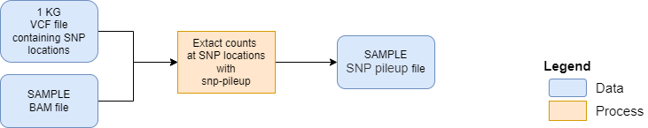
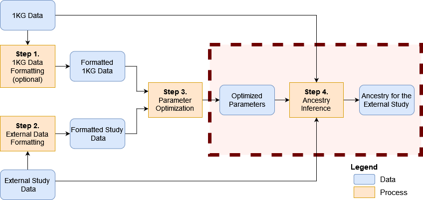

```{r style, echo=FALSE, results='hide', warning=FALSE, message=FALSE}
BiocStyle::markdown()

suppressPackageStartupMessages({
  library(knitr)
  library(RAIDS)
})

set.seed(121444)
```

<br />
**Package**: `r Rpackage("RAIDS")`<br />
**Authors**: `r packageDescription("RAIDS")[["Author"]]`<br />
**Version**: `r packageDescription("RAIDS")$Version`<br />
**Compiled date**: `r Sys.Date()`<br />
**License**: `r packageDescription("RAIDS")[["License"]]`<br />


# Licensing 

The `r Githubpkg("KrasnitzLab/RAIDS")` package and the underlying 
`r Githubpkg("KrasnitzLab/RAIDS")` code are distributed under  
the https://opensource.org/licenses/Apache-2.0 license. You are free to use and 
redistribute this software.  

<br>
<br>

# Citing

If you use the **RAIDS** package for a publication, we would ask you to cite 
the following:

> Pascal Belleau, Astrid Deschênes, David A. Tuveson, Alexander Krasnitz. Accurate and robust inference of genetic ancestry from cancer-derived molecular data across genomic platforms. bioRxiv 2022.02.01.478737; doi: https://doi.org/10.1101/2022.02.01.478737 

<br>
<br>

# Introduction

Multiple methods have been implemented to infer ancestry from germline DNA 
sequence [@Price2006; @Pritchard2000; @Alexander2009]. However, genotyping of 
DNA from matched normal specimens is not part of standard clinical practice
and is not performed routinely outside academic clinical centers. 
In sum, matched germline DNA sequence is often missing for cancer-derived 
molecular data. In such cases, having the possibility to infer ancestry 
from tumor-derived data would be beneficial.

The **RAIDS** package implements an inference procedure that has been
specifically developed to accurately infer genetic ancestry from 
cancer-derived sequencing. The covered cancer-derived sequencing are, more 
specifically, tumor exomes, targeted gene panels and RNA sequences.

The **RAIDS** package includes a data synthesis method that enables 
the selection of the
best parameters for a specific cancer profile and also permits a 
statistically assessment of inference accuracy for an individual 
cancer-derived molecular profile.

<br>
<br>

# Installation

To install the latest version accessible on the 
[RAIDS Github Website](https://github.com/KrasnitzLab/RAIDS "RAIDS Github Site"), 
the `r CRANpkg("devtools")` package is required.

```{r installDemo01, eval=FALSE}
## Load required package
library(devtools)

## Install the latest version of RAIDS
devtools::install_github('KrasnitzLab/RAIDS')
```

<br>
<br>


# Main Steps


This is an overview of genetic ancestry inference from cancer-derived 
molecular data:

```{r graphMainSteps, echo = FALSE, fig.align="center", fig.cap="An overview of the genetic ancestry inference process.", out.width = '120%', results='asis'}
knitr::include_graphics("MainSteps_v01.png")
```

The main steps are:

1. Format the information from 1000 Genomes (1KG) (optional)
2. Format the information from an external study
3. Find the optimized parameters for the ancestry inference
4. Run the ancestry inference on the external study

In the following sections, those main steps are described in details.

<br>
<br>

## Step 1 - Format the information from 1000 Genomes (optional)


```{r graphStep1, echo=FALSE, fig.align="center", fig.cap="Step 1 - Formatting the information from 1000 Genomes (optional)", out.width = '120%', results='asis'}
knitr::include_graphics("MainSteps_Step1_v01.png")
```


******

This step generates 3 important files:

- The 1KG GDS File
- The SNV Annotation GDS file
- The SNV Retained VCF file

<span style="color:darkred;font-weight:bold">Beware that the 3 pre-processed 
files are available at this address:</span>

<span style="color:red">
[https://labshare.cshl.edu/shares/krasnitzlab/aicsPaper](https://labshare.cshl.edu/shares/krasnitzlab/aicsPaper)
</span>

<span style="color:darkred;font-weight:bold">The size of the 1KG GDS file is 15GB.</span>
<span style="color:darkred;font-weight:bold">The 1KG GDS file is mapped on hg38.</span>

<span style="color:darkred;font-weight:bold">This section can be skipped if 
you choose to use the pre-processed files.</span>

The vignette [Formatting the information from 1000 Genomes (optional)](Create_1KG_GDS_file.html) is dedicated to this section.

<br>

## Step 2 - Format information from an external study to get it ready for ancestry inference

To be able to run the ancestry inference on samples from an external study, the 
information about the samples needs to follow a specific format.

The preparation of the external study data is divided is sub-steps.


```{r graphStep2, echo = FALSE, fig.align="center", fig.cap="Step 2 - Formatting the information from an external study", out.width = '120%', results='asis'}
knitr::include_graphics("MainSteps_Step2_v01.png")
```

The required sub-steps are:

1. Create a directory containing the 3 required reference files
2. Generate a Sample SNP pileup file (1 file per sample)
3. Create a RDS file containing information about the samples
4. Create a GDS Sample file (1 GDS file per sample)
5. Generate a pruned subset of the single nucleotide variants (SNVs) 
6. Estimate the allelic frequency for the pruned SNVs

Beware that a mapped BAM file is needed for each sample. The reference genome 
used for the mapping must correspond to the one used to generate the 
1KG GDS file. In this case, the 1KG GDS file is based on hg38 genome.

<br>

### Sub-Step 1. Create a directory containing the 3 required reference files

The 3 required reference files can be downloaded:

```{r download, echo=TRUE, eval=FALSE}
####################################
## The 1KG GDS file
####################################
wget https://labshare.cshl.edu/shares/krasnitzlab/aicsPaper/matGeno1000g.gds

####################################
## The 1KG SNV Annotation GDS file
####################################
wget https://labshare.cshl.edu/shares/krasnitzlab/aicsPaper/matAnnot1000g.gds

####################################
## The 1KG SNV Retained VCF file
####################################
wget https://labshare.cshl.edu/shares/krasnitzlab/aicsPaper/snvSel0.01.vcf.gz
```

The 3 files should be stored in the same directory. For the current 
demonstration, the directory will be refered as **PATH_REF**.

For more information on how to generate your own reference files, 
you can refer to the vignette 
[Formatting the information from 1000 Genomes (optional)](Create_1KG_GDS_file.html).

<br>

### Sub-Step 2. Generate a Sample SNP pileup file (1 file per sample)

This step requires the installation of the external code 
[snp-pileup](https://github.com/mskcc/facets/tree/master/inst/extcode) which 
is associated to the facets package [@Shen2016]. Given a VCF file 
containing SNP locations, 
[snp-pileup](https://github.com/mskcc/facets/tree/master/inst/extcode) 
application outputs, for each location, 
the counts of the reference and alternative nucleotide from an BAM input.

At this step, 
[snp-pileup](https://github.com/mskcc/facets/tree/master/inst/extcode) is used 
to generate a Sample SNP pileup file that will contain the reference and 
alternative 
nucleotides counts at each SNP location present in the reference 1KG GDS file.
The 1KG VCF file, which contains the list of retained 1KG SNVs, is required. 


```{r graphStep2_SubStep2, echo=FALSE, fig.align="center", fig.cap="Generate a Sample SNP pileup file (1 file per sample)", out.width='100%', results='asis'}

```

Beware that the name assigned to the Sample SNP pileup file will correspond to 
the Sample identifier (Name.ID) in the following analysis. For example, a SNP 
pileupe file called "Sample.01.txt.gz" would be associated to the 
sample "Sample.01". 

This is the command line to run 
[snp-pileup](https://github.com/mskcc/facets/tree/master/inst/extcode):

```{r snpPileup, echo=TRUE, eval=FALSE, highlight=TRUE}

#####################################################################
## Description of the parameters
## -g : Compresses the output file with BGZF
## -d5000 : Sets the maximum depth to 5000
## -q15 : Sets the minimum threshold for mapping quality to 15
## -Q20 : Sets the minimum threshold for base quality to 20
## -r0 : Sets the minimum read counts for a position to be output to 0
## PATH_REF/snvSel0.01.vcf.gz : The SNP Retained VCF file containing the positions of all retained 1KG SNPs
## PATH_OUT/Name.ID.txt : The name of the output Sample VCF file that will be compressed by the application
## FILEBAM.bam : The aligned reads from the sample used as input
#####################################################################
snp-pileup -g -d5000 -q15 -Q20  -r0 PATH_REF/snvSel0.01.vcf.gz PATH_OUT/Name.ID.txt FILEBAM.bam

```

<br>

### Sub-Step 3. Create a RDS file containing the information about the samples

A RDS file describing the samples that are part of the analysis is required.

The RDS file must contain a __data.frame__ with those 5 columns:

- **Name.ID**: The unique sample identifier. The GDS Sample file associated to 
this sample should be called "Name.ID.txt.gz". 
- **Case.ID**: The patient identifier associated to the sample.
- **Sample.Type**: The information about the sample type (primary tumor, 
metastasis, normal, etc..). 
- **Diagnosis**: The diagnosis associated to the patient.
- **Source**: The source of the sample (example: TCGA-BRCA).

This file is referred as the PED RDS file (PED for pedigree).


```{r pedCreation, echo=TRUE}
##############################################################
## Location of the new PED RDS file
##############################################################
data.dir <- system.file("extdata", package="RAIDS")
demo_PED_File <- file.path(data.dir, "Demo_PED.RDS")

##############################################################
## Create a data frame with the mandatory columns
## All columns are in character string format (no factor)
##############################################################
pedDF <- data.frame(Name.ID = c("Sample_01", "Sample_02", "Sample_03"),
                    Case.ID = c("Patient_h11", "Patient_h12", "Patient_h18"), 
                    Sample.Type = rep("Primary Tumor", 3),
                    Diagnosis = rep("Cancer", 3),
                    Source = rep("Databank B", 3),
                    stringsAsFactors = FALSE)

##############################################################
## Save the data frame into a RDS file
##############################################################
saveRDS(object=pedDF, file=demo_PED_File)

## Remove RDS file (created for demo purpose)
rm(demo_PED_File)
```

<br>

### Sub-Step 4. Create a GDS Sample file (1 GDS file per sample)

This step requires 4 files as input:

- The 1KG GDS file
- The Sample SNP pileup file (one per sample present in the study)
- The PED RDS file

A ___data.frame__ containing the general information about the study is 
also required. The __data.frame__ must have those 3 columns:

- **study.id**: The study identifier (example: TCGA-BRCA).
- **study.desc**: The description of the study.
- **study.platform**: The type of sequencing (example: RNA-seq).

Using all those inputs, the __createStudy2GDS1KG()_ function will 
generate a GDS Sample file. One GDS Sample file is created for each sample 
passed to the __listSamples__ argument.

```{r appendStudy2GDS1KG, echo=TRUE, eval=FALSE}
##############################################################
## Load required package
##############################################################
library(RAIDS)
    
##############################################################
## The 1KG GDS file and the 1KG SNV Annotation GDS file 
## need to be located in the same directory
##############################################################
PATH_1KG <- PATH_REF
    
fileName.GDS <- "matGeno1000g.gds"
file.GDS <- file.path(PATH_1KG, fileName.GDS)

#################################################################
## The Sample SNP pileup files (one per sample) need  
## to be located in the same directory.
#################################################################
PATHGENO <- file.path(PATH_SAMPLE_SNP_PILEUP)

#################################################################
## The path where the Sample GDS files (one per sample)
## will be created need to be specified.
#################################################################
PATHSAMPLEGDS <- file.path(PATH_SAMPLE_GDS_FILES)
    
#################################################################
## The path and file name for the PED RDS file 
## will the information about the analyzed samples
#################################################################
filePED <- FILE_PED
ped <- readRDS(filePED)
    
#################################################################
## A data frame containing general information about the study
## is also required. The data frame must have
## those 3 columns: "study.id", "study.desc", "study.platform"
#################################################################
studyDF <- data.frame(study.id = "Id of the study",
                  study.desc = "Description",
                  study.platform = "Whole-Exome",
                  stringsAsFactors = FALSE)

#################################################################
## The list of samples to analyzed is passed to the 
## function. The samples must be present in the PED RDS file
## and must have an associated Sample SNP pileup file.
## Not all samples present in the PED file need to be selected.
#################################################################
listSamples <- ped[, "Name.ID"]
    
#################################################################
## This function creates one GDS Sample file for each 
## sample present in the 'listSamples' parameter.
#################################################################
createStudy2GDS1KG(PATHGENO = PATHGENO,
                      pedStudy = ped,
                      fileNameGDS = file.GDS,
                      listSamples = listSamples,
                      studyDF = studyDF,
                      PATHSAMPLEGDS = PATHSAMPLEGDS)))
```

<br>

### Sub-Step 5. Generate a pruned subset of the single nucleotide variants (SNVs) 

The initial list of 1KG SNVs is pruned, using linkage disequilibrium analysis, 
to retained as subset of SNVs of interest for each sample. The 
list of selected SNVs is specific to each sample and the information about the 
retained SNVs is added to the GDS Sample file.

The __pruningSample()__ function requires the 1KG GDS file as input. It also 
requires the path to the GDS Sample files.

Beware that this step can requisite large disk space.

```{r pruningSample, echo=TRUE, eval=FALSE}
##############################################################
## Load required package
##############################################################
library(RAIDS)
    
##############################################################
## The 1KG GDS file is required 
##############################################################
PATH_1KG <- PATH_REF
    
fileName.GDS.1KG <- "matGeno1000g.gds"
file.GDS <- file.path(PATH_1KG, fileName.GDS.1KG)

## Open the 1KG GDS file
gds_1KG <- snpgdsOpen(file.GDS)

##############################################################
## All GDS Sample files need to be located in the same 
## directory.
##############################################################
PATHSAMPLEGDS <- PATH_WHERE_THE_GDS_SAMPLES_FILES_ARE_LOCATED

##############################################################
## The list of samples to analyse as obtained by the 
## PED RDS file. The samples must have an 
## associated GDS Sample file.
##############################################################
filePED <- FILE_PED
ped <- readRDS(filePED)
listSamples <- ped[, "Name.ID"]

#################################################################
## The study information passed to the function must correspond 
## the information present in the previously defined study 
## data.frame (see previous step).
#################################################################
studyDF <- data.frame(study.id = "Id of the study",  ## IMPORTANT INFORMATION
                  study.desc = "Description",
                  study.platform = "Whole-Exome",
                  stringsAsFactors = FALSE)

##############################################################
## The pruning function is called on one sample at the time
##############################################################
for(i in seq_len(length(listSamples))) {
  ## Compute the SNV pruned subset
  ## study.id: Study identifier as defined in the previous step.
  ##           The study identifier must be the same that the one present in
  ##           GDS Sample file.
  ## PATHSAMPLEGDS: All GDS Sample files must be in the same directory.
  pruningSample(gds=gds_1KG,
          sampleCurrent = listSamples[i],
          study.id = studyDF$study.id, 
          PATHSAMPLEGDS = PATHSAMPLEGDS) 
  
  ## GDS Sample file for the current sample
  ## The file name corresponds to the path + sample identifier + ".gds"
  file.GDSSample <- file.path(PATHSAMPLEGDS, paste0(listSamples[i], ".gds")
        
  ## Add the genotype information for the list of pruned SNVs 
  ## into the GDS Sample file
  ## The genotype information is extracted from the 1KG GDS file
  add1KG2SampleGDS(gds = gds_1KG, gdsSampleFile = file.GDSSample, 
                      sampleCurrent = listSamples[1], 
                      study.id = studyDF$study.id))
  
  ## Add annotation from the 1KG GDS file to the GDS Sample file
  ## This is required.
  addStudy1Kg(gds_1KG, file.GDSSample)
}
    
## Close the 1KG GDS file (it is important to always close the GDS files)
closefn.gds(gds_1KG)
```

<br>

### Sub-Step 6. Estimate the allelic fraction for the pruned SNVs

The __estimateAllelicFraction()__ estimates the allelic fraction for all 
SNVs present in the pruned SNV dataset. Beware that the function requires 
different inputs for DNA and RNA samples.

For the DNA samples, these 2 files are required:

1. The GDS Sample file
2. The 1KG GDS file

For the RNA samples, these 3 files are required:

1. The GDS Sample file
2. The 1KG GDS file
3. The 1KG SNv Annotation GDS file

In both cases, the other required inputs are:

1. The information about the length of the chromosomes
2. The sample identifier (it corresponds to the GDS Sample file name)
3. The study identifier (it should correspond to the one used previously)

The __estimateAllelicFraction()__ function processes one sample at the time. 


```{r estimateAllelicFraction, echo=TRUE, eval=FALSE}
###################################################################
## Load required package
###################################################################
library(RAIDS)
library(BSgenome)
library(BSgenome.Hsapiens.UCSC.hg38)

###################################################################
## The 1KG GDS file is required
## The 1KG SNV Annotation GDS file is only required for RNA samples
###################################################################
PATH_1KG <- PATH_REF
    
fileName.GDS.1KG <- "matGeno1000g.gds"
fileName.GDS.Annot <- "matAnnot1000g.gds"

file.GDS <- file.path(PATH_1KG, fileName.GDS)
file.Annot <- file.path(PATH_1KG, fileName.GDS.Annot)

## Open the 1KG GDS file     
gds <- snpgdsOpen(file.GDS)
    
###################################################################
## The length of each chromosome is required
## Chromosomes X, Y and M need relabeling
## There is other ways to extract the information
## This is one example
###################################################################
chrInfo <- integer(25L)
for(i in seq_len(22L)) {
    chrInfo[i] <- length(Hsapiens[[paste0("chr", i)]])
}
chrInfo[23] <- length(Hsapiens[["chrX"]])
chrInfo[24] <- length(Hsapiens[["chrY"]])
chrInfo[25] <- length(Hsapiens[["chrM"]])

###################################################################
## The GDS Sample file is required
###################################################################

## Name of the GDS Sample file 
## The name must corresponds to the sample identifier
file.GDSSample <- file.path(PATHSAMPLEGDS, paste0(sampleName, ".gds"))

## Open the GDS Sample file in writing mode
gdsSample <- openfn.gds(file.GDSSample, readonly = FALSE)

###################################################################
## The estimation of the allelic fraction
###################################################################

## Estimate the allelic fraction of the pruned SNVs 
## The current example is for a DNA sample
## In the case of RNA sample, the function needs different inputs
## such as the 1KG SNV Annotation GDS file and
## the block.id which refers to block.id in  the 1KG SNV Annotation GDS file 
## for the gene annotation of the SNVs
snp.pos <- estimateAllelicFraction(gds=gds, gdsSample=gdsSample,
                                      sampleCurrent=sampleName, 
                                      study.id=studyDF$study.id,
                                      chrInfo=chrInfo)

## Close both GDS files
closefn.gds(gdsSample)    
closefn.gds(gds)
```

<br>


## Step 3 - Find the optimized parameters for the ancestry inference

At this step, the optimization of the parameters is required to obtained the 
most accurate results at the ancestry inference step.

```{r graphStep3, echo = FALSE, fig.align="center", fig.cap="Step 3 - Find the optimized parameters for the ancestry inference", out.width = '120%', results='asis'}
knitr::include_graphics("MainSteps_Step3_v01.png")
```

Two parameters can be optimized for the ancestry inference process:

- _K_: the number of neighbors used to call the ancestry
- _D_: the number of dimensions used to create the PCA

The accuracy is evaluated through a synthetic dataset created from merging one 
cancer profile with multiple 1KG samples of known ancestry. Using the synthetic 
profiles, a range of _K_ and _D_ values are tested. Through that process, the 
_K_ and _D_ values with satisfying accuracy can be selected.

This step is divided in two sub-steps:

1. Generate the synthetic dataset
2. Compute the PCA-KNN ancestry call for each synthetic profile

### Sub-Step 1. Generate the synthetic dataset

A synthetic profile is generated through the merging of one cancer profile 
with one 1KG sample of known ancestry. Multiple 1KG samples of different 
ancestry are required to create a synthetic dataset that will be able to 
show the specific accuracy for each super-population. All the synthetic 
profiles are saved in the GDS Sample file corresponding to the cancer profile 
used to generate the dataset.

In summary, a fixed number of samples fo each super-population is extracted 
from the 1KG study. The information is saved in the GDS Sample file associated 
to the selected cancer profile. A synthetic profile is created for each 
combination of the 1KG samples and cancer profile. The synthetic profile is 
then saved in the GDS Sample file.

```{r generateSynthetic, echo=TRUE, eval=FALSE}
####################################################################
## Load required package
####################################################################
library(RAIDS)    
    
####################################################################
## Fix seed to ensure reproducible results
####################################################################    
set.seed(3043)   

####################################################################
## Randomly extract a fixed number of samples for each 
## subcontinental population present in the 1KG GDS file.
## When not enough samples are available, all samples are selected.  
####################################################################        
dataRef <- select1KGPop(gds, nbSamples = 30L)

## Extract the list of selected 1KG sample identifiers
listSampleRef <- dataRef$sample.id

####################################################################
## A data.frame with the description of the study for the synthetic
## data is required.
## The column names must be as shown 
#################################################################### 
studyDF.syn <- data.frame(study.id = "TCGA.BRCA.Synthetic",
                            study.desc = "TCGA.BRCA synthetic data",
                            study.platform = "WXS",
                            stringsAsFactors = FALSE)

## The GDS Sample file is needed
file.GDSSample <- PATH_TO_GDS_SAMPLE_FILE

# Just prepare the annotations for the synthetic data
# Add the information to the GDS sample file
prepSynthetic(gdsSampleFile = file.GDSSample,
                listSampleRef = listSampleRef,
                data.id.profile = sampleName,
                studyDF = studyDF.syn,
                nbSim = 1,
                prefId = "1")

##############################################################
## Both the 1KG GDS file and the 1KG SNV Annotation GDS file
## are required
##############################################################
PATH_1KG <- PATH_REF
    
fileName.GDS <- "matGeno1000g.gds"
fileName.GDS.Annot <- "matAnnot1000g.gds"
file.GDS <- file.path(PATH_1KG, fileName.GDS)
file.Annot <- file.path(PATH_1KG, fileName.GDS.Annot)

## Open the 1KG GDS file     
gds <- snpgdsOpen(file.GDS)
gds.Annot <- openfn.gds(file.Annot)

##############################################################
## The syntheticGeno() function generates the synthetic 
## profiles.
## The synthetic profiles are saved in the GDS Sample file
##############################################################
resG <- syntheticGeno(gds = gds,
                        gdsRefAnnot = gds.Annot,
                        gdsSampleFile = file.GDSSample,
                        data.id.profile = sampleName,
                        listSampleRef = listSampleRef,
                        nbSim = 1L,
                        prefId = "1")

## Close both GDS files
closefn.gds(gds)
closefn.gds(gds.Annot)
```

### Sub-Step 2. Compute the PCA-KNN ancestry call for each synthetic data


or in R 

```{r PCA.KNN.Synthetic, echo=TRUE, eval=FALSE}
####################################################################
## Load required package
####################################################################
library(RAIDS)    
    

##########################################
# Files related to the reference
# Downloaded
##########################################
PATH_1KG <- PATH_REF
    
fileName.GDS <- "matGeno1000g.gds"
file.GDS <- file.path(PATH_1KG, fileName.GDS)

##########################################
    
gds <- openfn.gds(file.GDS)

    
# Path to the directory where the gds file for each sample
# will be create
PATHSAMPLEGDS <- file.path("The path")
    
# directory which content directory name Name.ID in whihc the PCA is save
# 
PATH_OUT <- file.path("The path")
if(! file.exists(PATH_OUT)) {
  dir.create(PATH_OUT)
}
    
# Need a data.frame with study description for the
# synthetic data
studyDF.syn <- data.frame(study.id = "Id of the synthetic dataset",
                          study.desc = "Description",
                          study.platform = "Platform string like Whole Exome",
                          stringsAsFactors = FALSE)

    
# Look at studyDF at step 3.
study.id <- "Id of the study"
    
# The file ped defined before
filePED <- FILE_PED
ped <- readRDS(filePED)

# You need a list of the sample Name.ID 
# you can get it from other source than 
# filePED 
listSamples <- ped[, "Name.ID"]
    
# Get the known superPop for the reference
spRef <- getRef1KGPop(gds, "superPop")
    
# The set of 1KG use in the synthetic dataset
# if you use select1KGPop the seed must be the same 
# as the step 6 
    set.seed(3043)
    
    
####################################################################
## Fix seed as in step 6 to ensure the same results
####################################################################    
set.seed(3043)       
    
## Extract the 1KG samples used to generate the synthetic dataset
## Already done in step 6, no need to repeat if the results have been saved
dataRef <- select1KGPop(gds, nbSamples = 30L)

# Split dataRef by pop 
#
sampleRM <- splitSelectByPop(dataRef)
    
    
# Can be run in paralle or in different clusters...
for(i in seq_len(length(listSamples))){
        
  file.GDSSample <- file.path(PATHSAMPLEGDS, 
                                      paste0(listSamples[i], ".gds"))
  
  
  ## The directory where the output files will be created must exist      
  PATH_OUT_SAMPLE <- file.path(PATH_OUT, listSamples[i])
  if(! file.exists(PATH_OUT_SAMPLE)) {
            dir.create(PATH_OUT_SAMPLE)
  }
  
  ## Open GDS Sample file      
  gdsSample <- snpgdsOpen(file.GDSSample)
        
  # data.frame with the sample.id (Name.ID) with the study id
  KNN.list <- list()
        
  for(j in seq_len(nrow(sampleRM))) {
      KNN.synt <- computePoolSyntheticAncestryGr(gds = gds, 
                                          gdsSample = gdsSample,
                                          sampleRM =  sampleRM[j,],
                                          study.id.syn = studyDF.syn$study.id,
                                          np = 4L,
                                          spRef = spRef,
                                          eigen.cnt = 15L)
      KNN.list[[j]] <- KNN.synt$matKNN
  }
  
  KNN.sample.syn <- do.call(rbind, KNN.list)
  saveRDS(KNN.sample.syn, file.path(PATH_OUT_SAMPLE, 
                        paste0("KNN.synt.", listSamples[i], ".", i, ".rds")))
        
  ## Close GDS Sample file
  closefn.gds(gdsSample)
}
    
## Close both 1KG GDS file  
closefn.gds(gds)
```


<br>

## Step 4 - Run the ancestry inference on the external study

The ancestry inference is done with the optimized K and D parameters. More 
specifically, a PCA is generated using the 1KG reference samples and the 
cancer sample. The _D_ parameter specifies the number of dimension for the 
PCA. Then, the ancestry of the cancer sample is inferred using
a k-nearest neighbors classification method. The _K_ parameter specifies the 
number of neighbors used for the classification.


```{r graphStep4, echo = FALSE, fig.align="center", fig.cap="Step 4 - Run the ancestry inference on the external study", out.width = '120%', results='asis'}

```


The PCA of the sample and KNN sample and Call the ancestry with the optimal 
_K_ and _D_ parameters.

Note: The formal selection of _K_ and _D_ parameters is done at this step but 
all the synthetic data is prepared in the step 3. 


```{r PCA.KNN.Sample, echo=TRUE, eval=FALSE}
####################################################################
## Load required package
####################################################################
library(RAIDS)    
    

    ##########################################
    # Files related to the reference
    # Downloaded
    ##########################################
    PATH_1KG <- PATH_REF
    
    fileName.GDS <- "matGeno1000g.gds"
    
    file.GDS <- file.path(PATH_1KG, fileName.GDS)
    

    ##########################################
    
    gds <- openfn.gds(file.GDS)
    
    
    # Path to the directory where the gds file for each sample
    # will be create
    PATHSAMPLEGDS <- file.path("The path")
    
    # directory which content directory name Name.ID in whihc the PCA is save
    # 
    PATH_OUT <- file.path("The path")
    if(! file.exists(PATH_OUT)){
        dir.create(PATH_OUT)
    }
    
    # Need a data.frame with study description for the
    # synthetic data
    studyDF.syn <- data.frame(study.id = "Id of the synthetic dataset",
                          study.desc = "Descripttion",
                          study.platform = "Platform string like Whole Exome",
                          stringsAsFactors = FALSE)

    
    
    # Look at studyDF at step 3.
    study.id <- "Id of the study"
    
    # The file ped defined before
    filePED <- FILE_PED
    ped <- readRDS(filePED)
    # You need a list of the sample Name.ID 
    # you can get it from other source than 
    # filePED 
    listSamples <- ped[, "Name.ID"]
    
    # Get the known superPop for the reference
    spRef <- getRef1KGPop(gds, "superPop")
    
    
    
    # Can be run in parallel or in different clusters...
    for(i in seq_len(length(listSamples))){
        
        file.GDSSample <- file.path(PATHSAMPLEGDS, paste0(listSamples[i], ".gds"))
        
        PATHKNN <- file.path(PATH_OUT, listSamples[i])
        listFilesName <- dir(file.path(PATHKNN), ".rds")

        # List of the KNN result from PCA on synthetic data with path
        listFiles <- file.path(file.path(PATHKNN) , listFilesName)

        
        gdsSample <- snpgdsOpen(file.GDSSample)
        
        resCall <- computeAncestryFromSyntheticFile(gds = gds, 
                                            gdsSample = gdsSample,
                                            listFiles = listFiles,
                                            sample.ana.id = listSamples[i],
                                            spRef = spRef,
                                            study.id.syn = studyDF.syn$study.id,
                                            np = 4L)

        saveRDS(resCall, file.path(PATHOUT, 
                              paste0( listSamples[i], ".infoCall",".rds")))
        write.csv(resCall$Ancestry, file.path(PATHOUT, paste0( listSamples[i], ".Ancestry",".csv")),
                    quote = FALSE,
                    row.names = FALSE)

        closefn.gds(gdsSample)
    }
    
## Close both 1KG GDS file   
closefn.gds(gds)
```


<br>
<br>


# Pre-processed files are available

Pre-processed files, such as the 1KG GDS file, are available at this address:


[https://labshare.cshl.edu/shares/krasnitzlab/aicsPaper](https://labshare.cshl.edu/shares/krasnitzlab/aicsPaper)

Beware that some of those files are voluminous.

<br>
<br>

# Session info

Here is the output of `sessionInfo()` on the system on which this document was 
compiled:

```{r sessionInfo, echo=FALSE}
sessionInfo()
```

<br>
<br>


# References

