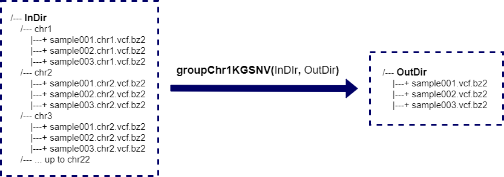
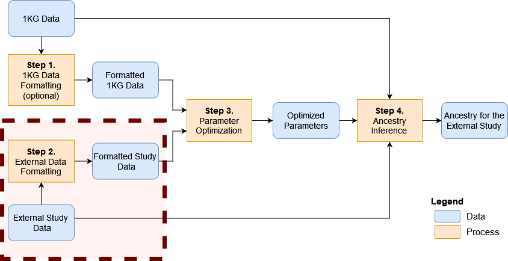

```{r style, echo = FALSE, results = 'hide', warning=FALSE, message=FALSE}
BiocStyle::markdown()

suppressPackageStartupMessages({
  library(knitr)
  library(aicsPaper)
})

set.seed(121444)
```

<br />
**Package**: `r Rpackage("aicsPaper")`<br />
**Authors**: `r packageDescription("aicsPaper")[["Author"]]`<br />
**Version**: `r packageDescription("aicsPaper")$Version`<br />
**Compiled date**: `r Sys.Date()`<br />
**License**: `r packageDescription("aicsPaper")[["License"]]`<br />


# Licensing 

The `r Githubpkg("belleau/aicsPaper")` package and the underlying 
`r Githubpkg("belleau/aicsPaper")` code are distributed under  
the Artistic license 2.0. You are free to use and 
redistribute this software.  

<br>
<br>

# Citing

If you use this package for a publication, we would ask you to cite the 
following:

> Pascal Belleau, Astrid Deschênes, David A. Tuveson, Alexander Krasnitz. Accurate and robust inference of genetic ancestry from cancer-derived molecular data across genomic platforms. bioRxiv 2022.02.01.478737; doi: https://doi.org/10.1101/2022.02.01.478737 

<br>
<br>

# Introduction

Multiple methods have been implemented to infer ancestry from germline DNA 
sequence [@Price2006; @Pritchard2000; @Alexander2009]. However, genotyping of 
DNA from matched normal specimens is not part of standard clinical practice
and is not performed routinely outside academic clinical centers. 
In sum, matched germline DNA sequence is often missing for cancer-derived 
molecular data. In such cases, having the possibility to infer ancestry 
from tumor-derived data would be beneficial.

The **aicsPaper** package implements an inference procedure that has been
specifically developed to accurately infer genetic ancestry from 
cancer-derived sequencing. The covered cancer-derived sequencing are, more 
specifically, tumor exomes, targeted gene panels and RNA sequences.


<br>
<br>

# Installation

To install the latest version accessible on the 
[aicsPaper Github Website](https://github.com/belleau/aicsPaper "aicsPaper Github Site"), 
the `r CRANpkg("devtools")` package is required.

```{r installDemo01, eval=FALSE}
## Load required package
library(devtools)

## Install the latest version of aicsPaper
devtools::install_github('belleau/aicsPaper')
```

<br>
<br>


# Main Steps


This is an overview of genetic ancestry inference from cancer-derived 
molecular data:

```{r graphMainSteps, echo = FALSE, fig.align="center", fig.cap="An overview of the genetic ancestry inference process.", out.width = '120%', results='asis'}
knitr::include_graphics("MainSteps_v01.png")
```

The main steps are:

1. Format the information from 1000 Genomes (1KG) (optional)
2. Format the information from an external study
3. Find the optimized parameters for the ancestry inference
4. Run the ancestry inference on the external study

In the following sections, those main steps are described in details.

<br>
<br>

## Step 1 - Formatting the information from 1000 Genomes (optional)


```{r graphStep1, echo = FALSE, fig.align="center", fig.cap="Step 1 - Formatting the information from 1000 Genomes (optional)", out.width = '120%', results='asis'}
knitr::include_graphics("MainSteps_Step1_v01.png")
```


This section explains in further details how to generate the 1000 Genomes (1KG) 
GDS file that is needed to run the ancestry inference tool. Beware that it 
is unnecessary to re-run those steps as the 1KG GDS file is publicly available. 

<span style="color:red">The 1KG GDS file will be available soon.</span>

More specifically, the formatting of the 1KG information includes all those 
sub-steps:

1. Download the required files from 1KG
2. Split the 1KG genotyping file to one file per sample per chromosome
3. Combine the chromosomes to obtain one genotyping file per sample
4. Create a pedigree file in RDS format
5. Prepare a bulk SNP information file based on 1KG VCF
6. Filter the bulk SNP information file
7. Generate the GDS file with the 1KG information
8. Identify genetically related patients present in 1KG GDS file
9. Add information about unrelated patients to the 1KG GDS file
10. Create a second GDS file containing the 1KG phase information

Beware that those sub-steps are time, as well as, space consuming.

In the following sections, those sub-steps are described in details.

<br>

### Download the required files from 1KG

First, the pedigree file with the description of the 1KG samples
needs to be downloaded from the 1KG ftp site:

> ftp://ftp.1000genomes.ebi.ac.uk/vol1/ftp/technical/working/20130606_sample_info/20130606_g1k.ped

The genotyping files for the 1KG samples also needs to be downloaded. Beware 
that there is one file per chromosome:

> ftp.1000genomes.ebi.ac.uk/vol1/ftp/data_collections/1000_genomes_project/release/20181203_biallelic_SNV

As the genotyping files are split by chromosome, all files corresponding to 
this pattern must be downloaded:

> ALL.chr\*.shapeit2_integrated_v1a.GRCh38.20181129.phased.vcf.gz

All files are related to GRCh38 genome.

<br>
<br>

### Split the 1KG genotyping file to one file per sample per chromosome

To facilitate the manipulation of the genotyping data, the large 1KG
genotyping files are split into smaller files (one per sample).

As there is one genotyping file per chromosome, the process must be executed 
for each of chromosome

The splitting is done through a bash script:

```{r fileGenopart1, echo=TRUE, eval=FALSE}
## This in not a R script
## This script is in bash

## The script has to be run separately for each chromosome

## Create one directory for the specific chromosome
##
## Two variables need to be assigned
## The variable PATHGENO is the path where the split 1KG genotyping 
##   files will be located
## The variable chrCur is the current chromosome (ex: "chr1"), a sub-directory 
##   with the name of the chromosome will be created. The variable must 
##   include the prefix "chr".
##
## Ex: PATHGENO=./genotypingPerSample
## Ex: chrCur=chr1
##
mkdir ${PATHGENO}/${chrCur}
cd ${PATHGENO}/${chrCur}

## The variable FILECUR is the associated 1KG genotyping VCF file for the 
##     specific chromosome
## The variable FILECUR must also contain the relative or complete path to 
##     the VCF file
## Ex: FILECUR=../../1KG_files/ALL.chr1.shapeit2_integrated_v1a.GRCh38.20181129.phased.vcf.gz

## There is 2548 samples in one phase VCF file
## The information associated to each sample is extracted and a VCF file 
## specific to each sample for the current chromosome is generated
##
for i in `seq 1 2548`
do
    j=$(( $i + 9 ))
    SAMPLE=$(zcat $FILECUR||head -n 1000 |grep "#CHROM"|cut -d$'\t' -f$j)
    zcat $FILECUR|grep -v "##"|cut -d$'\t' -f$j |bzip2 -c > ${SAMPLE}.${CHR}.vcf.bz2
done

```

<br>
<br>

### Combine the chromosomes to obtain one genotyping file per sample

The genotyping information for all chromosomes is merged so that there is only 
one genotyping file per sample.


```{r graphChr1KGSNV, echo = FALSE, fig.align="center", fig.cap="The function groupChr1KGSNV() merge samples that are split by chromosomes into one file.", out.width = '120%', results='asis'}

```


The __groupChr1KGSNV()__ function is used to combine the genotyping information 
from multiple files.

```{r fileGenopart2, echo=TRUE, eval=FALSE}
## Load required package
library(aicsPaper)

## The path where the genotyping files are located
PATHGENOCHR <- file.path("data", "pathgenochr")

## The path where the merged genotyping files will be created
PATHOUT <- file.path("data", "pathgenoOUT")

## Combining the genotyping information for all chromosome in one file per
## sample
groupChr1KGSNV(PATHGENOCHR, PATHOUT)

```

<br>
<br>

### Create a predigree file in RDS format

The function __prepPed1KG()__ is used to create the pedigree file 
in RDS format:

```{r prepPed1KG, eval=FALSE, echo=TRUE}
## Load required package
library(aicsPaper)

## The path to the pedigree file from 1KG
## In this example, the file is in the current directory
filePED1KGOri <- "20130606_g1k.ped"

## Extract needed information from the pedigree file from 1KG into a data.frame
## Only the samples with genotyping information (sample file present 
## in PATHGENO parameter) are retained to create the final data.frame
ped <- prepPed1KG(pedFile=filePED1KGOri, 
                    PATHGENO=file.path("data", "sampleGeno"))

## Save the pedigree information data.frame as a RDS file 
## In this example, the file is saved here ./data/metadata/ped1KG.rds
filePED1KG <- file.path("data", "metadata","ped1KG.rds")
saveRDS(ped,  filePED1KG)
    
```


<br>
<br>

### Prepare a bulk SNP information file based on 1KG VCF

Some intermediate file containing the SNP information from 1KG need to be
generated so the information can ultimately be imported in a GDS file 
using Bioconductor [gdsfmt](https://bioconductor.org/packages/gdsfmt/).

The bulk intermediate SNP file contains the SNP position as well as the 
frequency in each super population.

```{r intermediateVCF, echo=T, eval=FALSE}
## This is not done in R
## The python script is in the 'scriptsPy' directory
    
for i in `ls PATHVCF/*shapeit2_integrated_v1a.GRCh38.20181129.phased.vcf.gz`
do
  chr=$(echo $FILECUR|perl -n -e '/ALL\.(chr[^\.]+)/;print $1')
  python PATH2SCRIPT/extract1000gFreq.py ${FILECUR} matFreq.${chr}
done

for i in `seq 1 22`
do
  cat matFreq.chr${i}.txt >matFreqSNV.txt
  bzip2 matFreqSNV.txt
done
    
```

The bulk SNP info file is called __matFreqSNV.txt.bz2__.

<br>
<br>

### Filter the bulk SNP information file

The bulk SNP file is filtered to only retain the SNPs with frequency 
higher then a specific cut-off (here >=0.01) for at least one super 
population. 

The filter SNP file is saved in RDS format (_fileLSNP_ parameter). A 
second file containing the index of the retained SNPs is also 
created (*fileLSNP* parameter)

The function __generateMapSnvSel()__ is used to filter the SNP file and 
generated the needed RDS files:

```{r filterVCF, echo=T, eval=FALSE}
## Load required package
library(aicsPaper)

## The path to the bulk SNP info file
fileSNV.v <- file.path(PATHGENO, "matFreqSNV.txt.bz2")

## The paths and names of the two output files
## One file contains the index of retained SNPs ("listSNP.rds")
## One file contains the filter SNP information ("mapSNVSel.rds")
fileLSNP.v <- file.path(PATHSEL, "listSNP.rds")
fileFREQ.v <- file.path(PATHSEL, "mapSNVSel.rds")

## Filter the bulk SNP file (fileSNV parameter)
## Create a RDS with filter SNPs (fileFREQ parameter)
## Also creates a RDS with the indexes of the retained SNPs (fileFREQ parameter)
generateMapSnvSel(cutOff=0.01, fileSNV=fileSNV.v,
                      fileLSNP=fileLSNP.v,
                      fileFREQ=fileFREQ.v)
```


<br>
<br>


### Generate the GDS file with the 1KG information

The CoreArray Genomic Data Structure (GDS) data files are files suited for 
large-scale datasets, especially for data which are much larger than the 
available random-access memory.

The function __generateGDS1KG()__ is used to generate the GDS file that will
contain the information related to 1KG:

```{r gdsCreation, echo=TRUE, eval=FALSE}
## TODO: what is PATHMETA and PATHSEL

## The path and file names of the required files
## First, the RDS file containing the pedigree information
## Second, the RDS file with the indexes of the retained SNPs
## Third, the RDS file with the filtered SNP information 
filePED1KG <- file.path(PATHMETA,"ped1KG.rds")
fileLSNP.v <- file.path(PATHSEL, "listSNP.rds")
fileFREQ.v <- file.path(PATHSEL, "mapSNVSel.rds")

## The name of the GDS file that will be created    
fileNameGDS <- "matGeno1000g.gds"
fileGDS <- file.path(PATHGDS, fileNameGDS)
    
## Generate GDS file containing the 1KG information
generateGDS1KG(PATHGENO=file.path("data", "sampleGeno"),
                    fileNamePED=filePED1KG,
                    fileSNPSel=fileFREQ.v,
                    fileListSNP=fileLSNP.v,
                    fileNameGDS=fileGDS)
```


<br>
<br>

### Identify genetically related patients present in 1KG GDS file

As only unrelated patients can be used in the following analyses, the 
genetically related patients in 1KG must be identified.

The function __identifyRelative()__ identifies patients that are genetically 
related in the 1KG files. It generates a RDS file with the unrelated patient 
information (_filePart_ parameter) as well as a RDS file with the kinship 
coefficient between the patients (_fileIBD_ parameter).

```{r identifyRelative, echo=TRUE, eval=FALSE}
## Load required package
library(gdsfmt)

## TODO: what is PATHMETA 

## The name of the GDS file that contains the 1KG information    
fileNameGDS <- "matGeno1000g.gds"
fileGDS <- file.path(PATHGDS, fileNameGDS)

## Files that will be created by the identifyRelative() function
## The first RDS file will contain the kinship information between patients
## The second RDS file will contain the list of unrelated patients
fileIBD <- file.path(PATHMETA,"ibd.All.0.05.rds")
filePart <- file.path(PATHMETA,"part.All.0.05.rds")

## Open the 1KG GDS file
gds <- snpgdsOpen(fileGDS)

## Identify the genetically related patients in 1KG
identifyRelative(gds=fileGDS, maf=0.05, thresh = 2^(-11/2),
                     fileIBD=fileIBD, filePart=filePart)

## Close the 1KG GDS file
closefn.gds(gds)
```

<br>
<br>


### Add information about unrelated patients to the 1KG GDS file

Only the unrelated patients from 1KG are used in the following ancestry 
inference and kept in the GDS 1KG file. The function __identifyRelative()__ 
identifies the unrelated patients and saves the information about those 
patients in an intermediate external file. 

The function __addRef2GDS1KG()__ is adding the information about the unrelated
patients to the GDS 1KG file using the intermediate external file.

```{r addRef2GDS1KG, echo=TRUE, eval=FALSE}
## Add the information about the unrelated 1KG patients to the 1KG GDS file 
addRef2GDS1KG(fileGDS=gds,  filePart=filePart)
```

<br>
<br>

### Create a second GDS containing the 1KG phase information 

We generate a GDS with the phase information.

The function __generatePhase1KG2GDS()__ is adding the phase information 
into the newly created 1KG GDS phase file.

```{r addPhaseGDS1KG, echo=TRUE, eval=FALSE}
## Load required package
library(gdsfmt)

## The name of the 1KG GDS file that already exists
fileGDS1KG <- file.path(PATHGDS, "matGeno1000g.gds")

## The name of the 1KG GDS phase file that will be created
fileGDSPhase <- file.path(PATHGDS, "matPhase1000g.gds")

## Open the 1KG GDS file
gds <- openfn.gds(fileGDS1KG)

## Create the 1KG GDS phase file
gdsPhase <- createfn.gds(fileGDSPhase)

## Add the phase information to the 1KG GDS phase file
generatePhase1KG2GDS(gds, gdsPhase, PATHGENO, fileLSNP.v)

## Close both files
closefn.gds(gdsPhase)
closefn.gds(gds)
```

<br>
<br>


## Step 2 - Format information from an external study to get if ready for ancestry inference

To run the ancestry inference on samples from an external study, the sample
information must be formatted in a specific format.


```{r graphStep2, echo = FALSE, fig.align="center", fig.cap="Step 2 - Formatting the information from an external study", out.width = '120%', results='asis'}

```


Those steps shows how to prepare the sample information needed as input 
for the ancestry inference.

Those steps are:

1. Extract the read coverage at each SNP position in the 1KG GDS file
2. Create a VCF file containing the retained SNP positions from 1KG GDS file

Beware that a mapped BAM file is needed for each sample. The reference genome 
used for the mapping must correspond to the one used to generate the 
1KG GDS file. In this case, the 1KG GDS file is based on genome hg38.

### Extract the read coverage at each SNP position in the 1KG GDS file

We used here snp-pileup from Facet

First you a vcf file with the SNV you want to keep

<br>
<br>

### Create a VCF file containing the retained SNP positions from 1KG GDS file

The __snvListVCF()__ function is used to generate a VCF file that contains
the information of all retained SNPs from 1KG GDS fil:

```{r snvListVCF, echo=TRUE, eval=FALSE}
## Load required package
library(aicsPaper)

## Open the 1KG GDS file    
gds <- snpgdsOpen(fileGDS1kg)

## The VCF file that will be created
fileOUT <- "SNPretained.VCF"

## Generate the VCF with the retained SNP position
snvListVCF(gds=gds, fileOUT=fileOUT, offset=1, freqCutoff=NULL)

## Close the 1KG GDS file 
closefn.gds(gds)
``` 

You should compress and indexing the newly created VCF file. Do do so, 
you need to install [HTSlib](http://www.htslib.org/download/) [@Bonfield2021].

In a terminal:

```{r indexVCF, echo=TRUE, eval=FALSE}
## This in not a R script
## This script is in bash

## Compress the new VCF file (fileOUT parameter)
bgzip fileOUT

## Index the new VCF file
## HTSlib software is needed
tabix -p vcf fileOUT.gz
```


You need a __ped__ file with the column:

"sample.id"* Id of the sample but the sample can be genotyped more than one
"sex"*
"pop.group"* can be self declare or something else but must be there
"superPop"* can be self declare or something else but must be there
"Sample.Type"* Ex Primary Tumor or Blood Derived Normal 
"Diagnosis"* C or N (cancer normal) this is for the sample not the patient
"Source"* The tissue ex Ovary 
"Recurrent"  
"Case.ID" Patient identifiant     
"Name.ID"* This the unique id of the table
"batch" Number

You need the extra code in the package Facet to extract the SNV
[snp-pileup](https://github.com/mskcc/facets/tree/master/inst/extcode) 
[@Shen2016].

The output from snp-pileup should be Name.ID.txt 
(snp-pileup add .gz to the filename) 

```{r snpPileup, echo=TRUE, eval=FALSE}

    snp-pileup -g -d5000 -q15 -Q20  -r0 VCFGenerateAbove snvSel0.01.vcf.gz OUTPUT.txt FILEBAM.bam
    
```

TODO change the path to something generic

in R:

```{r appendStudy2GDS1KG, echo=TRUE, eval=FALSE}

    library(aicsPaper)
    
    PATHGENO <- file.path("data", "snpCancer")
    PATHMETA <- file.path("data", "metadata")
    PATHGDS <- file.path("data", "genoGDS1000gAF.All.TCGA_OV.WXS")
    
    fileNamePED <- "pedTCGA_OV_WXS_C.rds"
    fileNameGDS <- "matGeno1000g.gds"
    
    filePED <- file.path(PATHMETA, fileNamePED)
    fileNameGDS <- file.path(PATHGDS, fileNameGDS)
    
    ped <- readRDS(filePED)
    
    studyDF <- data.frame(study.id = "TCGA-OV.WXS.C",
                              study.desc = "Ovarian example",
                              study.platform = "WXS",
                              stringsAsFactors = FALSE)
    
    listSamples <- ped[, "Name.ID"]
    appendStudy2GDS1KG(PATHGENO = PATHGENO,
                       fileNamePED = filePED,
                       fileNameGDS = fileNameGDS,
                       listSamples = listSamples,
                       studyDesc = studyDF,
                       batch = 1)
```


We select a subset of SNV pruned SNV
We create a GDS for each sample with only the SNP in the pruning.
It use more disk space but the analysis for the samples can be run simulatanusly 
with multiple process (if we we all samples in one file only one process can 
write in the GDS). 


or in R for a s

```{r pruningSample, echo=TRUE, eval=FALSE}

    library(aicsPaper)
    
    # fileNameGDS with the sample and 1KG genotype
    # listSamples list of sample.id from the study
    # PATHSAMPLEGDS is the path where the gds specific 
    # to the sample is created
    
    studyCur <- "Study.name"
    gds <- snpgdsOpen(fileNameGDS)
    
    
    
    sampleGDS <- index.gdsn(gds, "sample.id")
    sample.id <- read.gdsn(sampleGDS)
    
    study.offset <- read.gdsn(index.gdsn(gds, "study.offset"))
    
    study.id <- read.gdsn(index.gdsn(gds, "study.annot/study.id"))
    
    listSamples <- sample.id[which(study.id == studyCur) + study.offset]

    for(i in seq_len(length(listSamples))){
        print(system.time(pruned <- pruningSample(gds=gds,
                                            method="corr",
                                            sampleCurrent = listSamples[i],
                                            listSNP = NULL,
                                            slide.max.bp.v = 5e5,
                                            ld.threshold.v=sqrt(0.1),
                                            np = 1,
                                            verbose.v=FALSE,
                                            chr = NULL,
                                            minAF.SuperPop = NULL,
                                            keepGDSpruned = TRUE,
                                            PATHSAMPLEGDS = PATHSAMPLEGDS,
                                            keepFile = FALSE)))
    }
    
    Sys.time()
    closefn.gds(gds)
```


<br>
<br>

# Session info

Here is the output of `sessionInfo()` on the system on which this document was 
compiled:

```{r sessionInfo, echo=FALSE}
sessionInfo()
```

<br>
<br>


# References

