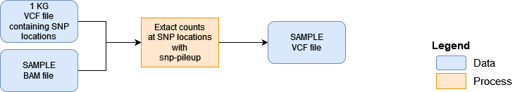

```{r style, echo=FALSE, results='hide', warning=FALSE, message=FALSE}
BiocStyle::markdown()

suppressPackageStartupMessages({
  library(knitr)
  library(RAIDS)
})

set.seed(121444)
```

<br />
**Package**: `r Rpackage("RAIDS")`<br />
**Authors**: `r packageDescription("RAIDS")[["Author"]]`<br />
**Version**: `r packageDescription("RAIDS")$Version`<br />
**Compiled date**: `r Sys.Date()`<br />
**License**: `r packageDescription("RAIDS")[["License"]]`<br />


# Licensing 

The `r Githubpkg("KrasnitzLab/RAIDS")` package and the underlying 
`r Githubpkg("KrasnitzLab/RAIDS")` code are distributed under  
the https://opensource.org/licenses/Apache-2.0 license. You are free to use and 
redistribute this software.  

<br>
<br>

# Citing

If you use the **RAIDS** package for a publication, we would ask you to cite 
the following:

> Pascal Belleau, Astrid Deschênes, David A. Tuveson, Alexander Krasnitz. Accurate and robust inference of genetic ancestry from cancer-derived molecular data across genomic platforms. bioRxiv 2022.02.01.478737; doi: https://doi.org/10.1101/2022.02.01.478737 

<br>
<br>

# Introduction

Multiple methods have been implemented to infer ancestry from germline DNA 
sequence [@Price2006; @Pritchard2000; @Alexander2009]. However, genotyping of 
DNA from matched normal specimens is not part of standard clinical practice
and is not performed routinely outside academic clinical centers. 
In sum, matched germline DNA sequence is often missing for cancer-derived 
molecular data. In such cases, having the possibility to infer ancestry 
from tumor-derived data would be beneficial.

The **RAIDS** package implements an inference procedure that has been
specifically developed to accurately infer genetic ancestry from 
cancer-derived sequencing. The covered cancer-derived sequencing are, more 
specifically, tumor exomes, targeted gene panels and RNA sequences.

The **RAIDS** package includes a data synthesis method that enables 
the selection of the
best parameters for a specific cancer profile and also permits a 
statistically assessment of inference accuracy for an individual 
cancer-derived molecular profile.

<br>
<br>

# Installation

To install the latest version accessible on the 
[RAIDS Github Website](https://github.com/KrasnitzLab/RAIDS "RAIDS Github Site"), 
the `r CRANpkg("devtools")` package is required.

```{r installDemo01, eval=FALSE}
## Load required package
library(devtools)

## Install the latest version of RAIDS
devtools::install_github('KrasnitzLab/RAIDS')
```

<br>
<br>


# Main Steps


This is an overview of genetic ancestry inference from cancer-derived 
molecular data:

```{r graphMainSteps, echo = FALSE, fig.align="center", fig.cap="An overview of the genetic ancestry inference process.", out.width = '120%', results='asis'}
knitr::include_graphics("MainSteps_v01.png")
```

The main steps are:

1. Format the information from 1000 Genomes (1KG) (optional)
2. Format the information from an external study
3. Find the optimized parameters for the ancestry inference
4. Run the ancestry inference on the external study

In the following sections, those main sections are described in details.

<br>
<br>

## Step 1 - Format the information from 1000 Genomes (optional)


```{r graphStep1, echo=FALSE, fig.align="center", fig.cap="Step 1 - Formatting the information from 1000 Genomes (optional)", out.width = '120%', results='asis'}
knitr::include_graphics("MainSteps_Step1_v01.png")
```


******

This step generates 3 important files:

- The 1KG GDS File
- The SNP Annotation GDS file
- The SNP Retained VCF file

<span style="color:darkred;font-weight:bold">Beware that the 3 pre-processed 
files are available at this address:</span>

<span style="color:red">
[https://labshare.cshl.edu/shares/krasnitzlab/aicsPaper](https://labshare.cshl.edu/shares/krasnitzlab/aicsPaper)
</span>

<span style="color:darkred;font-weight:bold">The size of the 1KG GDS file is 15GB.</span>
<span style="color:darkred;font-weight:bold">The 1KG GDS file is mapped on hg38.</span>

<span style="color:darkred;font-weight:bold">This section can be skipped if 
you choose to use the pre-processed files.</span>

******

The vignette [Formatting the information from 1000 Genomes (optional)](Create_1KG_GDS_file.html) is dedicated to this section.

<br>

## Step 2 - Format information from an external study to get it ready for ancestry inference

To run the ancestry inference on samples from an external study. The 
information about the samples needs to follow a specific format.


```{r graphStep2, echo = FALSE, fig.align="center", fig.cap="Step 2 - Formatting the information from an external study", out.width = '120%', results='asis'}
knitr::include_graphics("MainSteps_Step2_v01.png")
```

The required steps are:

1. Create a directory containing the 3 required reference files
2. Generate a Sample VCF file (1 VCF file per sample)
3. Create a RDS file containing information about the samples
4. Create a GDS Sample file (1 GDS file per sample)
5. Generate a pruned subset of the single nucleotide variants (SNVs)  

Beware that a mapped BAM file is needed for each sample. The reference genome 
used for the mapping must correspond to the one used to generate the 
1KG GDS file. In this case, the 1KG GDS file is based on genome hg38.

<br>

### Step 1. Create a directory containing the 3 required reference files

The 3 required reference files can be downloaded:

```{r download, echo=TRUE, eval=FALSE}
####################################
## The 1KG GDS file
####################################
wget https://labshare.cshl.edu/shares/krasnitzlab/aicsPaper/matGeno1000g.gds

####################################
## The 1KG SNP Annotation GDS file
####################################
wget https://labshare.cshl.edu/shares/krasnitzlab/aicsPaper/matAnnot1000g.gds

####################################
## The 1KG SNP Retained VCF file
####################################
wget https://labshare.cshl.edu/shares/krasnitzlab/aicsPaper/snvSel0.01.vcf.gz
```

The 3 files should be stored in the same directory. For the current 
demonstration, the directory will be refered as **PATH_REF**.

For more information on how to generate your own reference files, 
you can refer to the vignette 
[Formatting the information from 1000 Genomes (optional)](Create_1KG_GDS_file.html).

<br>

### Step 2. Generate a Sample VCF file (1 file per sample)

This step requires the installation of the external code 
[snp-pileup](https://github.com/mskcc/facets/tree/master/inst/extcode) which 
is associated to the facets package [@Shen2016]. 

Given a VCF file containing SNP locations, [snp-pileup](https://github.com/mskcc/facets/tree/master/inst/extcode) 
application outputs, for each location, 
the counts of the reference and alternative nucleotide from an BAM input.

At this step, 
[snp-pileup](https://github.com/mskcc/facets/tree/master/inst/extcode) is used 
to generate a Sample VCF file that will contain the reference and alternative 
nucleotides counts at each SNP location present in the reference 1KG GDS file.
The 1KG VCF file which contains the list of retained 1KG SNPs is required. 


```{r graphStep2_SubStep2, echo=FALSE, fig.align="center", fig.cap="Generate a Sample VCF file (1 file per sample)", out.width='100%', results='asis'}

```

Beware that the name assigned to the Sample VCF file will correspond to the 
Sample identifier (Name.ID) in the following analysis. For example, a VCF 
called "Sample.01.txt.gz" would be associated to the sample "Sample.01". 


```{r snpPileup, echo=TRUE, eval=FALSE, highlight=TRUE}

#####################################################################
## Description of the parameters
## -g : Compresses the output file with BGZF
## -d5000 : Sets the maximum depth to 5000
## -q15 : Sets the minimum threshold for mapping quality to 15
## -Q20 : Sets the minimum threshold for base quality to 20
## -r0 : Sets the minimum read counts for a position to be output to 0
## PATH_REF/snvSel0.01.vcf.gz : The SNP Retained VCF file containing the positions of all retained 1KG SNPs
## PATH_OUT/Name.ID.txt : The name of the output Sample VCF file that will be compressed by the application
## FILEBAM.bam : The aligned reads from the sample used as input
#####################################################################
snp-pileup -g -d5000 -q15 -Q20  -r0 PATH_REF/snvSel0.01.vcf.gz PATH_OUT/Name.ID.txt FILEBAM.bam

```


<br>

### Step 3. Create a RDS file containing information about the samples

A RDS file describing the samples that are part of the analysis is required.

The RDS file must contain a \code{data.frame} with those 5 columns:

- **Name.ID**: The unique sample identifier. The GDS Sample file associated to 
this sample should be called "Name.ID.txt.gz". 
- **Case.ID**: The patient identifier associated to the sample.
- **Sample.Type**: The information about the sample type (primary tissue, 
xenograft, organoid, etc..). 
- **Diagnosis**: The diagnosis associated to the patient.
- **Source**: The source of the sample.

This file is referred as the PED RDS file (PED for pedigree).


```{r pedCreation, echo=TRUE, }
#########################################################
## Assign name and directory for the new PED RDS file
#########################################################
data.dir <- system.file("extdata", package="RAIDS")
demo_PED_File <- file.path(data.dir, "Demo_PED.RDS")
    
## Create the data frame with the mendatory columns
pedDF <- data.frame(Name.ID = c("Sample_01", "Sample_02", "Sample_03"),
                     Case.ID = c("Patient_h11", "Patient_h12", "Patient_h18"), 
                     Sample.Type = rep("Primary Tumor", 3),
                     Diagnosis = rep("Cancer", 3),
                     Source = rep("Databank B", 3),
                     stringsAsFactors = FALSE)

## Save the data frame into a RDS file
saveRDS(object=pedDF, file=demo_PED_File)

## Remove RDS file (created for demo purpose)
rm(demo_PED_File)
```


### Step 4. Create a GDS Sample file (1 GDS file per sample)

This step requires 4 files as input:

- The 1KG GDS file
- The 1KG SNP Annotation GDS file  (Pascal, do we need that one?)
- The 1KG SNP Retained VCF file 
- The VCF Sample file
- The PED RDS file

A \code{data.frame} containing the general information about the study is 
also required. The \code{data.frame} must have those 3 columns:

- **study.id**
- **study.desc**
- **study.platform**

Using those inputs, the function _appendStudy2GDS1KG()_ will generate 
a GDS Sample file. 

One GDS Sample file is created for each sample passed to the 
__listSamples__ argument.

```{r appendStudy2GDS1KG, echo=TRUE, eval=FALSE}
##############################################################
## Load required package
##############################################################
library(RAIDS)
    
##############################################################
## The 1KG GDS file and the 1KG SNP Annotation GDS file 
## need to be located in the same directory
##############################################################
PATH_1KG <- PATH_REF
    
fileName.GDS <- "matGeno1000g.gds"
fileName.GDS.Annot <- "matAnnot1000g.gds"   ## Pascal, do you need this file at this step?
file.GDS <- file.path(PATH_1KG, fileName.GDS)
file.Annot <- file.path(PATH_1KG, fileName.GDS.Annot)

#################################################################
## The Sample VCF files (one per sample) need  
## to be located in the same directory
#################################################################
PATHGENO <- file.path(PATH_PILEUP)

#################################################################
## The path where the Sample GDS files (one per sample)
## will be created need to be specified
#################################################################
PATHSAMPLEGDS <- file.path("Sample_GDS_directory")
    
#################################################################
## The path and filename for the PED RDS file 
## will the information about the analyzed samples
#################################################################
filePED <- FILE_PED
    
#################################################################
## A data frame containing general information about the study
## is also required. The data frame must have
## those 3 columns: "study.id", "study.desc", "study.platform"
#################################################################
studyDF <- data.frame(study.id = "Id of the study",
                  study.desc = "Description",
                  study.platform = "Platform string like Whole Exome",
                  stringsAsFactors = FALSE)

#################################################################
## The list of samples to analyzed is passed to the 
## function. The samples must be present in the PED RDS file
## and must have an associated GDS Sample file.
#################################################################
listSamples <- ped[, "Name.ID"]
    
#################################################################
## This function creates one GDS Sample file for each 
## sample present in the listSamples parameter
#################################################################
appendStudy2GDS1KG(PATHGENO = PATHGENO,
                      fileNamePED = filePED,
                      fileNameGDS = file.GDS,
                      listSamples = listSamples,
                      batch = 1,
                      studyDF = studyDF,
                      PATHSAMPLEGDS = PATHSAMPLEGDS)))
    
```

<br>

### Step 5. Generate a pruned subset of the single nucleotide variants (SNVs) 

A pruned subset of SNVs is retained for the following analyses. The 
list of selected SNVs is specific to each sample and the information about the 
retained SNVs is added to the GDS Sample file.

This step is requiring a lot of disk space and the process can be run on 
multiple threads. 

???:It use more disk space but the analysis for the samples can be run 
simultaneously 
with multiple process (if we we all samples in one file only one process can 
write in the GDS). 


or in R for a s

```{r pruningSample, echo=TRUE, eval=FALSE}

    library(RAIDS)
    
    ##########################################
    # Files related to the reference
    # Downloaded
    ##########################################
    PATH_1KG <- PATH_WHERE_THE_REFERENCE_1KG_IS_LOCATED
    
    fileName.GDS.1KG <- "matGeno1000g.gds"
    fileName.GDS.Annot <- "matAnnot1000g.gds"
    file.GDS <- file.path(PATH_1KG, fileName.GDS.1KG)
    file.Annot <- file.path(PATH_1KG, fileName.GDS.Annot)

    ##########################################
    
    # Path to the directory where the GDS Sample files are located 
    # will be create
    PATHSAMPLEGDS <- PATH_WHERE_THE_GDS_SAMPLES_FILES_ARE_LOCATED
    
    gds_1KG <- snpgdsOpen(file.GDS)
    
    # The file ped defined before
    filePED <- FILE_PED
    ped <- readRDS(filePED)
    # You need a list of the sample Name.ID 
    # you can get it for other source than 
    # filePED 
    listSamples <- ped[, "Name.ID"]
    
    
    # Can be run in parallel or in different clusters...
    for(i in seq_len(length(listSamples))){
        # Compute the SNV pruned subset
        pruningSample(gds=gds_1KG,
                      method="corr",
                      sampleCurrent = listSamples[i],
                      listSNP = NULL,
                      slide.max.bp.v = 5e5,
                      ld.threshold.v=sqrt(0.1),
                      np = 1,
                      verbose.v=FALSE,
                      chr = NULL,
                      minAF.SuperPop = NULL,
                      keepGDSpruned = TRUE,
                      PATHSAMPLEGDS = PATHSAMPLEGDS,
                      keepFile = FALSE)
        
        # Add the genotype of 1KG and of the sample listSamples[i] 
        # for SNV pruned in the gdsSample
        addStudy1Kg(gds_1KG, file.path(PATHSAMPLEGDS, paste0(listSamples[i], ".gds")))
        # Add the sample name from 1KG in the study.annot of gdsSample
        addStudy1Kg(gds_1KG, file.GDSSample)

    }
    
    
    closefn.gds(gds)
```

### Step 5. Estimate the allelic for the SNV pruned 


or in R for a s

```{r estimateAllelicFraction, echo=TRUE, eval=FALSE}

    library(RAIDS)
    library(BSgenome)
    library(BSgenome.Hsapiens.UCSC.hg38)

    ##########################################
    # Files related to the reference
    # Downloaded
    ##########################################
    PATH_1KG <- PATH_REF
    
    fileName.GDS <- "matGeno1000g.gds"
    fileName.GDS.Annot <- "matAnnot1000g.gds"
    file.GDS <- file.path(PATH_1KG, fileName.GDS)
    file.Annot <- file.path(PATH_1KG, fileName.GDS.Annot)

    ##########################################
    
    gds <- snpgdsOpen(file.GDS)
    
    # Path to the directory where the gds file for each sample
    # will be create
    PATHSAMPLEGDS <- file.path("The path")
    
    # Look at studyDF at step 3.
    study.id <- "Id of the study"
    
    # The file ped defined before
    filePED <- FILE_PED
    ped <- readRDS(filePED)
    # You need a list of the sample Name.ID 
    # you can get it from other source than 
    # filePED 
    listSamples <- ped[, "Name.ID"]
    
    # You need the autosomal chr length from the genome.
    chrInfo <- integer(22)
    
    for(i in seq_len(22)){
        chrInfo[i] <- length(Hsapiens[[paste0("chr", i)]])
    }

    # Can be run in paralle or in different clusters...
    for(i in seq_len(length(listSamples))){
        file.GDSSample <- file.path(PATHSAMPLEGDS, paste0(listSamples[i], ".gds"))
        gdsSample <- openfn.gds(file.GDSSample, readonly = FALSE)

        estimateAllelicFraction(gds, gdsSample,
                                listSamples[i], study.id,
                                chrInfo)
        closefn.gds(gdsSample)
    }
    
    
    closefn.gds(gds)
```

### Step 6. Generate the synthetic dataset


or in R 

```{r generateSynthetic, echo=TRUE, eval=FALSE}

    library(RAIDS)
    

    ##########################################
    # Files related to the reference
    # Downloaded
    ##########################################
    PATH_1KG <- PATH_REF
    
    fileName.GDS <- "matGeno1000g.gds"
    fileName.GDS.Annot <- "matAnnot1000g.gds"
    file.GDS <- file.path(PATH_1KG, fileName.GDS)
    file.Annot <- file.path(PATH_1KG, fileName.GDS.Annot)

    ##########################################
    
    gds <- openfn.gds(file.GDS)
    gds.Annot <- openfn.gds(file.Annot)

    
    # Path to the directory where the gds file for each sample
    # will be create
    PATHSAMPLEGDS <- file.path("The path")
    
    
    # Need a data.frame with study description for the
    # synthetic data
    studyDF <- data.frame(study.id = "Id of the synthetic dataset",
                              study.desc = "Descripttion",
                              study.platform = "Platform string like Whole Exome",
                              stringsAsFactors = FALSE)
    
    
    
    # Look at studyDF at step 3.
    study.id <- "Id of the study"
    
    # The file ped defined before
    filePED <- FILE_PED
    ped <- readRDS(filePED)
    # You need a list of the sample Name.ID 
    # you can get it from other source than 
    # filePED 
    listSamples <- ped[, "Name.ID"]
    
    # You need a set of 1KG too use in the synthetic dataset
    # You need a list of id from 1KG get from file
    # or use the select1KGPop
    # The function select1KGPop select nbSamples 
    # of each 1KG pop.group (subcontinental)
    # with the same seed the function generate the same set
    set.seed(3043)
    dataRef <- select1KGPop(gds, nbSamples = 30L)
    listSampleRef <- dataRef$sample.id
    
    # Can be run in paralle or in different clusters...
    for(i in seq_len(length(listSamples))){
        
        file.GDSSample <- file.path(PATHSAMPLEGDS, paste0(listSamples[i], ".gds"))
        prepSynthetic(file.GDSSample,
              listSampleRef,
              listSamples[i],
              studyDF,
              nbSim = 1,
              prefId = "1")

        # synthetic data generator
        resG <- syntheticGeno(gds,
                              gds.Annot,
                              file.GDSSample,
                              listSamples[i],
                              listSampleRef,
                              nbSim = 1,
                              prefId = "1")

    }
    
    
    closefn.gds(gds)
    closefn.gds(gds.Annot)
    
```

### Step 7. Compute the PCA-KNN ancestry call for each synthetic data


or in R 

```{r PCA.KNN.Synthetic, echo=TRUE, eval=FALSE}

    library(RAIDS)
    

    ##########################################
    # Files related to the reference
    # Downloaded
    ##########################################
    PATH_1KG <- PATH_REF
    
    fileName.GDS <- "matGeno1000g.gds"
    fileName.GDS.Annot <- "matAnnot1000g.gds"
    file.GDS <- file.path(PATH_1KG, fileName.GDS)
    file.Annot <- file.path(PATH_1KG, fileName.GDS.Annot)

    ##########################################
    
    gds <- openfn.gds(file.GDS)
    gds.Annot <- openfn.gds(file.Annot)

    
    # Path to the directory where the gds file for each sample
    # will be create
    PATHSAMPLEGDS <- file.path("The path")
    
    # directory which content directory name Name.ID in whihc the PCA is save
    # 
    PATH_OUT <- file.path("The path")
    if(! file.exists(PATH_OUT)){
        dir.create(PATH_OUT)
    }
    
    # Need a data.frame with study description for the
    # synthetic data
    studyDF <- data.frame(study.id = "Id of the synthetic dataset",
                              study.desc = "Descripttion",
                              study.platform = "Platform string like Whole Exome",
                              stringsAsFactors = FALSE)
    
    
    
    # Look at studyDF at step 3.
    study.id <- "Id of the study"
    
    # The file ped defined before
    filePED <- FILE_PED
    ped <- readRDS(filePED)
    # You need a list of the sample Name.ID 
    # you can get it from other source than 
    # filePED 
    listSamples <- ped[, "Name.ID"]
    
    # Get the known superPop for the reference
    spRef <- getRef1KGPop(gds, "superPop")
    listSuperPop <- c("EAS", "EUR", "AFR", "AMR", "SAS")
    
    # The set of 1KG use in the synthetic dataset
    # if you use select1KGPop the seed must be the same 
    # as the step 6 
    set.seed(3043)
    dataRef <- select1KGPop(gds, nbSamples = 30L)
    
    
    # Split dataRef by pop 
    #
    sampleRM <- splitSelectByPop(dataRef)
    
    
    # Can be run in paralle or in different clusters...
    for(i in seq_len(length(listSamples))){
        
        file.GDSSample <- file.path(PATHSAMPLEGDS, paste0(listSamples[i], ".gds"))
        
        PATH_OUT_SAMPLE <- file.path(PATH_OUT, listSamples[i])
        if(! file.exists(PATH_OUT_SAMPLE)){
            dir.create(PATH_OUT_SAMPLE)
        }
        
        gdsSample <- snpgdsOpen(file.GDSSample)
        
        # data.frame with the sample.id (Name.ID) with the study id
        
        for(j in seq_len(nrow(sampleRM))){
            pca1KG <- ccomputePCARefRMMulti(gdsSample, names(spRef),sampleRM[j,])
            resPCA <- computePCAMultiSynthetic(gdsSample, pca1KG,
                                               sampleRM[i,], "CRC.Synthetic")
            
            

            studyDF <- computeKNNRefSynthetic(gdsSample, resPCA, listSuperPop,
                                               studyDF$study.id, spRef)
            KNN.list[[j]] <- KNN.synt$matKNN
        }
        KNN.sample.syn <- do.call(rbind, KNN.list)
        
        pedSyn <- prepPedSynthetic1KG(gds, gdsSample, studyDF$study.id, "superPop")
        
        fieldPopIn1KG <- "superPop"
        fieldPopInfAnc <- "SuperPop"
        listParaSample[[listSamples[i]]] <- selParaPCAUpQuartile(KNN.sample.syn, pedSyn, fieldPopIn1KG, fieldPopInfAnc, listSuperPop)
        
        listPCASample[[listSamples[i]]] <- computePCARefSample(gdsSample, listSamples[i], study.id.ref = "Ref.1KG")
        
        
        listKNNSample[[listSamples[i]]] <- computeKNNSuperPopSample(gdsSample, listSamples[i], spRef)

        
        closefn.gds(gdsSample)
    }
    
    
    closefn.gds(gds)
    closefn.gds(gds.Annot)
    
```

### Step 8. Select paramters for the PCA-KNN ancestry call


or in R 

```{r selectParameters, echo=TRUE, eval=FALSE}

    library(RAIDS)
    

    ##########################################
    # Files related to the reference
    # Downloaded
    ##########################################
    PATH_1KG <- PATH_REF
    
    fileName.GDS <- "matGeno1000g.gds"
    fileName.GDS.Annot <- "matAnnot1000g.gds"
    file.GDS <- file.path(PATH_1KG, fileName.GDS)
    file.Annot <- file.path(PATH_1KG, fileName.GDS.Annot)

    ##########################################
    
    gds <- openfn.gds(file.GDS)
    gds.Annot <- openfn.gds(file.Annot)

    
    # Path to the directory where the gds file for each sample
    # will be create
    PATHSAMPLEGDS <- file.path("The path")
    
    # directory which content directory name Name.ID in whihc the PCA is save
    # 
    PATH_OUT <- file.path("The path")
    
    
    # Need a data.frame with study description for the
    # synthetic data
    studyDF <- data.frame(study.id = "Id of the synthetic dataset",
                              study.desc = "Descripttion",
                              study.platform = "Platform string like Whole Exome",
                              stringsAsFactors = FALSE)
    
    
    
    # Look at studyDF at step 3.
    study.id <- "Id of the study"
    
    # The file ped defined before
    filePED <- FILE_PED
    ped <- readRDS(filePED)
    # You need a list of the sample Name.ID 
    # you can get it from other source than 
    # filePED 
    listSamples <- ped[, "Name.ID"]
    
    
    spRef <- getRef1KGPop(gds, "superPop")
    

    # Can be run in paralle or in different clusters...
    listParaSample <- list()
    listPCASample <- list()
    listKNNSample <- list()
    listAncestrySample <- list()
    for(i in seq_len(length(listSamples))){
        
        file.GDSSample <- file.path(PATHSAMPLEGDS, paste0(listSamples[i], ".gds"))
        gdsSample <- snpgdsOpen(file.GDSSample)
        
        PATH_OUT_SAMPLE <- file.path(PATH_OUT, listSamples[i])
        # The directory PATH_OUT_SAMPLE must just content 
        # only the rds files from step 7
        listSynthetic <- dir(PATH_OUT_SAMPLE, ".rds")
        listKNN <- list()
        for(i in seq_len(length(listSynthetic))){
            tmp <- readRDS(file.path(PATHSYN, listSynthetic[i]))
            listKNN[[i]] <- tmp$resKNN$matKNN
        }
        matKNN.All <- do.call(rbind, listKNN)

        # The parameter superPop is define by the output of step 7
        # the function return data.frame with the known superPop 
        # associate with synthetic data.
        
        pedSyn <- prepPedSynthetic1KG(gds, gdsSample, studyDF$study.id, "superPop")
        
        # list of superPop in synthetic dataset
        listSP <- unique(pedSyn$superPop)
        
        # The SuperPop is the super population field in matKNN.All
        # superPop are the known super population from the ref
        # return the parameter selected.
        listParaSample[[listSamples[i]]] <- selParaPCAUpQuartile(matKNN.All, pedSyn, "superPop", "SuperPop", listSP)
        
        listPCASample[[listSamples[i]]] <- computePCARefSample(gdsSample, listSamples[i], study.id.ref = "Ref.1KG")
        
        
        listKNNSample[[listSamples[i]]] <- computeKNNSuperPopSample(gdsSample, listSamples[i], spRef)
        
        listAncestrySample[[listSamples[i]]] <- 
    }
    
    
    
    closefn.gds(gds)
    closefn.gds(gds.Annot)
    
```


<br>
<br>

# Pre-processed files are available

Pre-processed files, such as the 1KG GDS file, are available at this address:


[https://labshare.cshl.edu/shares/krasnitzlab/aicsPaper](https://labshare.cshl.edu/shares/krasnitzlab/aicsPaper)

Beware that some of those files are voluminous.

<br>
<br>

# Session info

Here is the output of `sessionInfo()` on the system on which this document was 
compiled:

```{r sessionInfo, echo=FALSE}
sessionInfo()
```

<br>
<br>


# References

